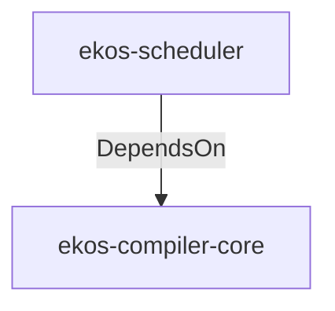

# ekos-scheduler (Crate)

## Properties

| Key | Value |
|---|---|
| `description` | Re-exports scheduler types from compiler-core (Phase 1 — thin crate) |
| `path` | ekos/crates/scheduler |

## Relationships

### DependsOn

- → ekos-compiler-core (`2690bc0d-0233-516f-b969-9e87432f623d`) — evidence: ekos-scheduler depends on ekos-compiler-core (path dependency)

## Diagram

## Evidence

- `dadd953a-18e9-4cd5-a838-b7789a82ee0d` — ekos-scheduler depends on ekos-compiler-core (path dependency) (confidence: 1.00)
