# ekos-semantic (Crate)

## Properties

| Key | Value |
|---|---|
| `description` | Semantic compiler pass: KIR → Canonical Knowledge Model (Phase 8) |
| `path` | ekos/crates/semantic |

## Relationships

### DependsOn

- ← ekos-benchmark (`20c26e43-ee96-5ee7-a046-25740fbbd56b`) — evidence: ekos-benchmark depends on ekos-semantic (path dependency)
- → async-trait (`7c905290-824b-57e0-a559-15ff1499b4d6`) — evidence: ekos-semantic depends on async-trait 0.1
- → chrono (`0d184cc1-2483-516d-a0b5-0b6bfad54805`) — evidence: ekos-semantic depends on chrono 0.4
- → ekos-artifact (`8806bf54-6364-5052-b85a-cef4344e8f19`) — evidence: ekos-semantic depends on ekos-artifact (path dependency)
- → ekos-common (`dc169f0a-98f1-5c7c-8dd0-1dbc8504e9c9`) — evidence: ekos-semantic depends on ekos-common (path dependency)
- → ekos-compiler-core (`2690bc0d-0233-516f-b969-9e87432f623d`) — evidence: ekos-semantic depends on ekos-compiler-core (path dependency)
- → ekos-identity (`2c6b8d9a-83ed-510e-a5d8-a76f2e8685fe`) — evidence: ekos-semantic depends on ekos-identity (path dependency)
- → ekos-kir (`7e3bc0de-d888-55cd-aa9a-f333f6e2cbb2`) — evidence: ekos-semantic depends on ekos-kir (path dependency)
- → serde_json (`02548eee-6478-5324-851f-3a6329ccfeca`) — evidence: ekos-semantic depends on serde 1
- → thiserror (`bbefe8a3-f76e-509f-910b-b439cd7eeff6`) — evidence: ekos-semantic depends on thiserror 2
- → tracing (`4282d266-2850-5d04-a992-0f0a204788aa`) — evidence: ekos-semantic depends on tracing 0.1
- → uuid (`ba61f6c0-d160-5eaf-a437-895cee5c72e9`) — evidence: ekos-semantic depends on uuid 1
- ← ekos (`abd31cd9-b31d-54c5-87cd-8a4a5b9a30a0`) — evidence: ekos depends on ekos-semantic (path dependency)
- ← ekos-recovery (`28244ebb-4e16-5e8d-a637-5e750d01f2b8`) — evidence: ekos-recovery depends on ekos-semantic (path dependency)

## Diagram

```mermaid
graph TD
    nf82d9ce0df2a5af89f9a2bd5f8484839["ekos-semantic"]
    n20c26e43ee965ee7a04625740fbbd56b["ekos-benchmark"]
    n20c26e43ee965ee7a04625740fbbd56b -->|DependsOn| nf82d9ce0df2a5af89f9a2bd5f8484839
    n7c905290824b57e0a55915ff1499b4d6["async-trait"]
    nf82d9ce0df2a5af89f9a2bd5f8484839 -->|DependsOn| n7c905290824b57e0a55915ff1499b4d6
    n0d184cc12483516da0b50b6bfad54805["chrono"]
    nf82d9ce0df2a5af89f9a2bd5f8484839 -->|DependsOn| n0d184cc12483516da0b50b6bfad54805
    n8806bf5463645052b85acef4344e8f19["ekos-artifact"]
    nf82d9ce0df2a5af89f9a2bd5f8484839 -->|DependsOn| n8806bf5463645052b85acef4344e8f19
    ndc169f0a98f15c7c8dd01dbc8504e9c9["ekos-common"]
    nf82d9ce0df2a5af89f9a2bd5f8484839 -->|DependsOn| ndc169f0a98f15c7c8dd01dbc8504e9c9
    n2690bc0d0233516fb9699e87432f623d["ekos-compiler-core"]
    nf82d9ce0df2a5af89f9a2bd5f8484839 -->|DependsOn| n2690bc0d0233516fb9699e87432f623d
    n2c6b8d9a83ed510ea5d8a76f2e8685fe["ekos-identity"]
    nf82d9ce0df2a5af89f9a2bd5f8484839 -->|DependsOn| n2c6b8d9a83ed510ea5d8a76f2e8685fe
    n7e3bc0ded88855cdaa9af333f6e2cbb2["ekos-kir"]
    nf82d9ce0df2a5af89f9a2bd5f8484839 -->|DependsOn| n7e3bc0ded88855cdaa9af333f6e2cbb2
    n02548eee64785324851f3a6329ccfeca["serde_json"]
    nf82d9ce0df2a5af89f9a2bd5f8484839 -->|DependsOn| n02548eee64785324851f3a6329ccfeca
    nbbefe8a3f76e509f910bb439cd7eeff6["thiserror"]
    nf82d9ce0df2a5af89f9a2bd5f8484839 -->|DependsOn| nbbefe8a3f76e509f910bb439cd7eeff6
    n4282d26628505d04a9920f0a204788aa["tracing"]
    nf82d9ce0df2a5af89f9a2bd5f8484839 -->|DependsOn| n4282d26628505d04a9920f0a204788aa
    nba61f6c0d1605eafa437895cee5c72e9["uuid"]
    nf82d9ce0df2a5af89f9a2bd5f8484839 -->|DependsOn| nba61f6c0d1605eafa437895cee5c72e9
    nabd31cd9b31d54c587cd8a4a5b9a30a0["ekos"]
    nabd31cd9b31d54c587cd8a4a5b9a30a0 -->|DependsOn| nf82d9ce0df2a5af89f9a2bd5f8484839
    n28244ebb4e165e8da6375e750d01f2b8["ekos-recovery"]
    n28244ebb4e165e8da6375e750d01f2b8 -->|DependsOn| nf82d9ce0df2a5af89f9a2bd5f8484839
```

## Evidence

- `6e6c4449-6a48-421f-97f8-8d508da86a4f` — ekos-benchmark depends on ekos-semantic (path dependency) (confidence: 1.00)
- `8bf8732f-3d66-449c-aa58-0daf53824998` — ekos-semantic depends on async-trait 0.1 (confidence: 1.00)
- `654c4e03-8f4c-494f-8472-a9586cf49d04` — ekos-semantic depends on chrono 0.4 (confidence: 1.00)
- `a1784fce-8991-4e73-8308-75f31751567e` — ekos-semantic depends on ekos-artifact (path dependency) (confidence: 1.00)
- `7724e8cd-4067-4adc-943d-591653b91f50` — ekos-semantic depends on ekos-common (path dependency) (confidence: 1.00)
- `246857cc-a5cb-4c9f-9a19-266a20644802` — ekos-semantic depends on ekos-compiler-core (path dependency) (confidence: 1.00)
- `969ac429-a1e3-4ac8-8115-c4bda83492c2` — ekos-semantic depends on ekos-identity (path dependency) (confidence: 1.00)
- `1048ce03-94bb-4c6e-9412-794a7761982c` — ekos-semantic depends on ekos-kir (path dependency) (confidence: 1.00)
- `7714e855-f014-4d94-a0d7-6761ae395f4b` — ekos-semantic depends on serde 1 (confidence: 1.00)
- `2ea9b7ab-b848-43ce-9235-4eb912be072d` — ekos-semantic depends on serde_json 1 (confidence: 1.00)
- `14e939f4-8b53-47ba-a083-099b8539613a` — ekos-semantic depends on thiserror 2 (confidence: 1.00)
- `6746d2e9-5b9c-4db9-ae44-d2e13dd1d15e` — ekos-semantic depends on tracing 0.1 (confidence: 1.00)
- `6ced7539-5dd7-4b31-86a7-929f35939968` — ekos-semantic depends on uuid 1 (confidence: 1.00)
- `2bb917e9-c254-4db7-b88c-2057ae24a093` — ekos depends on ekos-semantic (path dependency) (confidence: 1.00)
- `6222ffaf-0679-4a9a-9214-bfea0a439042` — ekos-recovery depends on ekos-semantic (path dependency) (confidence: 1.00)
