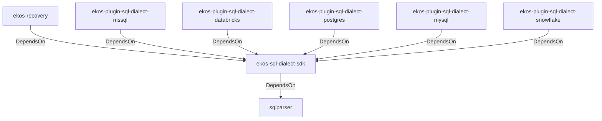

# ekos-sql-dialect-sdk (Crate)

## Properties

| Key | Value |
|---|---|
| `description` | SqlDialectParser trait — the contract a pluggable SQL dialect crate implements (RFC 0031) |
| `path` | ekos/crates/sql-dialect-sdk |

## Relationships

### DependsOn

- → sqlparser (`bb72fd94-a6bc-5672-84ef-bdeeb20ad78c`) — evidence: ekos-sql-dialect-sdk depends on sqlparser 0.53
- ← ekos-recovery (`28244ebb-4e16-5e8d-a637-5e750d01f2b8`) — evidence: ekos-recovery depends on ekos-sql-dialect-sdk (path dependency)
- ← ekos-plugin-sql-dialect-mssql (`05ad9d89-d39c-5316-b413-2903b6b557db`) — evidence: ekos-plugin-sql-dialect-mssql depends on ekos-sql-dialect-sdk (path dependency)
- ← ekos-plugin-sql-dialect-databricks (`920f4203-48d4-5079-a5ee-41b212c4858c`) — evidence: ekos-plugin-sql-dialect-databricks depends on ekos-sql-dialect-sdk (path dependency)
- ← ekos-plugin-sql-dialect-postgres (`ff9a3a7c-0610-5442-ac0b-210e45700aad`) — evidence: ekos-plugin-sql-dialect-postgres depends on ekos-sql-dialect-sdk (path dependency)
- ← ekos-plugin-sql-dialect-mysql (`001696e1-9479-5c36-ae53-08898760049d`) — evidence: ekos-plugin-sql-dialect-mysql depends on ekos-sql-dialect-sdk (path dependency)
- ← ekos-plugin-sql-dialect-snowflake (`15989d49-59f8-564e-a77d-c90d2d87c80b`) — evidence: ekos-plugin-sql-dialect-snowflake depends on ekos-sql-dialect-sdk (path dependency)

## Diagram

## Evidence

- `3f0d0f1e-c266-4993-8b8a-fec7ec6b6959` — ekos-sql-dialect-sdk depends on sqlparser 0.53 (confidence: 1.00)
- `8d407b28-bcb4-49b5-b705-4669c07d90f0` — ekos-recovery depends on ekos-sql-dialect-sdk (path dependency) (confidence: 1.00)
- `0ada9dad-353a-4f76-97b5-0b6e3204a2a3` — ekos-plugin-sql-dialect-mssql depends on ekos-sql-dialect-sdk (path dependency) (confidence: 1.00)
- `ccc55b4a-d6e9-4880-89c8-52aa896e77a1` — ekos-plugin-sql-dialect-databricks depends on ekos-sql-dialect-sdk (path dependency) (confidence: 1.00)
- `bc938656-155b-473f-8027-31f18ea9fe69` — ekos-plugin-sql-dialect-postgres depends on ekos-sql-dialect-sdk (path dependency) (confidence: 1.00)
- `2f0254db-5fb1-4399-bdef-369d426326b4` — ekos-plugin-sql-dialect-mysql depends on ekos-sql-dialect-sdk (path dependency) (confidence: 1.00)
- `fe4d1d0f-dd0b-4ac7-8bb4-90bf627cb13a` — ekos-plugin-sql-dialect-snowflake depends on ekos-sql-dialect-sdk (path dependency) (confidence: 1.00)
