# ekos (Crate)

## Properties

| Key | Value |
|---|---|
| `description` | Enterprise Knowledge Operating System — CLI |
| `path` | ekos/crates/cli |

## Relationships

### DependsOn

- ← ekos-integration-tests (`063808f9-5f19-5d62-b3dd-69eaa93d44cb`) — evidence: ekos-integration-tests depends on ekos (path dependency)
- → anyhow (`0cdec207-5b1a-5831-bd2a-8b57ddb8681c`) — evidence: ekos depends on anyhow 1
- → chrono (`0d184cc1-2483-516d-a0b5-0b6bfad54805`) — evidence: ekos depends on chrono 0.4
- → clap (`1e555a57-22c3-53c4-8855-6df09b834cfc`) — evidence: ekos depends on clap 4
- → dotenvy (`e2259b17-c46a-59c2-8d8f-2110c3bbb347`) — evidence: ekos depends on dotenvy 0.15
- → ekos-artifact (`8806bf54-6364-5052-b85a-cef4344e8f19`) — evidence: ekos depends on ekos-artifact (path dependency)
- → ekos-common (`dc169f0a-98f1-5c7c-8dd0-1dbc8504e9c9`) — evidence: ekos depends on ekos-common (path dependency)
- → ekos-compiler-core (`2690bc0d-0233-516f-b969-9e87432f623d`) — evidence: ekos depends on ekos-compiler-core (path dependency)
- → ekos-dbt-gen (`9b66a043-a009-58d6-b446-20001b04c706`) — evidence: ekos depends on ekos-dbt-gen (path dependency)
- → ekos-docs-gen (`ee66e2d3-bd7f-53c2-a9f9-7dcb7cba59b3`) — evidence: ekos depends on ekos-docs-gen (path dependency)
- → ekos-ekl (`d932eaf4-7069-5419-a00c-fa4b7b374c86`) — evidence: ekos depends on ekos-ekl (path dependency)
- → ekos-identity (`2c6b8d9a-83ed-510e-a5d8-a76f2e8685fe`) — evidence: ekos depends on ekos-identity (path dependency)
- → ekos-kir (`7e3bc0de-d888-55cd-aa9a-f333f6e2cbb2`) — evidence: ekos depends on ekos-kir (path dependency)
- → ekos-ledger (`9c977335-c421-519c-a889-558f0487574e`) — evidence: ekos depends on ekos-ledger (path dependency)
- → ekos-marketing (`18dba45d-9534-5035-bd6f-df6b370079ac`) — evidence: ekos depends on ekos-marketing (path dependency)
- → ekos-observation-sdk (`9a955a3a-55bc-587a-942d-fb81d6260052`) — evidence: ekos depends on ekos-observation-sdk (path dependency)
- → ekos-plugin-confluence (`e8d1a3c9-e7b2-5084-bdfc-569e7b604054`) — evidence: ekos depends on ekos-plugin-confluence (path dependency)
- → ekos-plugin-crypto (`835d6e67-5bb0-53e7-9104-338881612548`) — evidence: ekos depends on ekos-plugin-crypto (path dependency)
- → ekos-plugin-file (`06b65958-abb7-5fe1-a6ee-d35946d39062`) — evidence: ekos depends on ekos-plugin-file (path dependency)
- → ekos-plugin-git (`df977fc8-e004-518e-b267-581520ccd448`) — evidence: ekos depends on ekos-plugin-git (path dependency)
- → ekos-plugin-github (`aff4d491-b33f-56d7-b0ba-e03e884983fd`) — evidence: ekos depends on ekos-plugin-github (path dependency)
- → ekos-plugin-localdocs (`0659fbf3-d2f4-54ba-835f-a7f6f875a7d1`) — evidence: ekos depends on ekos-plugin-localdocs (path dependency)
- → ekos-plugin-pentaho (`dac1d743-a50e-57a9-8acb-56e29a47ef5e`) — evidence: ekos depends on ekos-plugin-pentaho (path dependency)
- → ekos-plugin-python (`020c78ca-f337-542f-b351-8b4201393bbb`) — evidence: ekos depends on ekos-plugin-python (path dependency)
- → ekos-plugin-rust (`07179bab-d486-5b14-8c68-6e743e45b3f6`) — evidence: ekos depends on ekos-plugin-rust (path dependency)
- → ekos-recovery (`28244ebb-4e16-5e8d-a637-5e750d01f2b8`) — evidence: ekos depends on ekos-recovery (path dependency)
- → ekos-runtime (`f4cd2d3b-f0b0-5234-ab2b-39de3275d717`) — evidence: ekos depends on ekos-runtime (path dependency)
- → ekos-semantic (`f82d9ce0-df2a-5af8-9f9a-2bd5f8484839`) — evidence: ekos depends on ekos-semantic (path dependency)
- → serde_json (`02548eee-6478-5324-851f-3a6329ccfeca`) — evidence: ekos depends on serde_json 1
- → tokio (`4a4e8d5c-5102-5d1d-addd-d7fb0bc8d7b9`) — evidence: ekos depends on tokio 1
- → toml (`b2678e73-f1ed-50db-8272-d18217301a2a`) — evidence: ekos depends on toml 0.8
- → tracing (`4282d266-2850-5d04-a992-0f0a204788aa`) — evidence: ekos depends on tracing 0.1
- → uuid (`ba61f6c0-d160-5eaf-a437-895cee5c72e9`) — evidence: ekos depends on uuid 1
- → walkdir (`40b5029d-b6e8-55ee-bc22-14411e3d0fb2`) — evidence: ekos depends on walkdir 2

## Diagram

```mermaid
graph TD
    nabd31cd9b31d54c587cd8a4a5b9a30a0["ekos"]
    n063808f95f195d62b3dd69eaa93d44cb["ekos-integration-tests"]
    n063808f95f195d62b3dd69eaa93d44cb -->|DependsOn| nabd31cd9b31d54c587cd8a4a5b9a30a0
    n0cdec2075b1a5831bd2a8b57ddb8681c["anyhow"]
    nabd31cd9b31d54c587cd8a4a5b9a30a0 -->|DependsOn| n0cdec2075b1a5831bd2a8b57ddb8681c
    n0d184cc12483516da0b50b6bfad54805["chrono"]
    nabd31cd9b31d54c587cd8a4a5b9a30a0 -->|DependsOn| n0d184cc12483516da0b50b6bfad54805
    n1e555a5722c353c488556df09b834cfc["clap"]
    nabd31cd9b31d54c587cd8a4a5b9a30a0 -->|DependsOn| n1e555a5722c353c488556df09b834cfc
    ne2259b17c46a59c28d8f2110c3bbb347["dotenvy"]
    nabd31cd9b31d54c587cd8a4a5b9a30a0 -->|DependsOn| ne2259b17c46a59c28d8f2110c3bbb347
    n8806bf5463645052b85acef4344e8f19["ekos-artifact"]
    nabd31cd9b31d54c587cd8a4a5b9a30a0 -->|DependsOn| n8806bf5463645052b85acef4344e8f19
    ndc169f0a98f15c7c8dd01dbc8504e9c9["ekos-common"]
    nabd31cd9b31d54c587cd8a4a5b9a30a0 -->|DependsOn| ndc169f0a98f15c7c8dd01dbc8504e9c9
    n2690bc0d0233516fb9699e87432f623d["ekos-compiler-core"]
    nabd31cd9b31d54c587cd8a4a5b9a30a0 -->|DependsOn| n2690bc0d0233516fb9699e87432f623d
    n9b66a043a00958d6b44620001b04c706["ekos-dbt-gen"]
    nabd31cd9b31d54c587cd8a4a5b9a30a0 -->|DependsOn| n9b66a043a00958d6b44620001b04c706
    nee66e2d3bd7f53c2a9f97dcb7cba59b3["ekos-docs-gen"]
    nabd31cd9b31d54c587cd8a4a5b9a30a0 -->|DependsOn| nee66e2d3bd7f53c2a9f97dcb7cba59b3
    nd932eaf470695419a00cfa4b7b374c86["ekos-ekl"]
    nabd31cd9b31d54c587cd8a4a5b9a30a0 -->|DependsOn| nd932eaf470695419a00cfa4b7b374c86
    n2c6b8d9a83ed510ea5d8a76f2e8685fe["ekos-identity"]
    nabd31cd9b31d54c587cd8a4a5b9a30a0 -->|DependsOn| n2c6b8d9a83ed510ea5d8a76f2e8685fe
    n7e3bc0ded88855cdaa9af333f6e2cbb2["ekos-kir"]
    nabd31cd9b31d54c587cd8a4a5b9a30a0 -->|DependsOn| n7e3bc0ded88855cdaa9af333f6e2cbb2
    n9c977335c421519ca889558f0487574e["ekos-ledger"]
    nabd31cd9b31d54c587cd8a4a5b9a30a0 -->|DependsOn| n9c977335c421519ca889558f0487574e
    n18dba45d95345035bd6fdf6b370079ac["ekos-marketing"]
    nabd31cd9b31d54c587cd8a4a5b9a30a0 -->|DependsOn| n18dba45d95345035bd6fdf6b370079ac
    n9a955a3a55bc587a942dfb81d6260052["ekos-observation-sdk"]
    nabd31cd9b31d54c587cd8a4a5b9a30a0 -->|DependsOn| n9a955a3a55bc587a942dfb81d6260052
    ne8d1a3c9e7b25084bdfc569e7b604054["ekos-plugin-confluence"]
    nabd31cd9b31d54c587cd8a4a5b9a30a0 -->|DependsOn| ne8d1a3c9e7b25084bdfc569e7b604054
    n835d6e675bb053e79104338881612548["ekos-plugin-crypto"]
    nabd31cd9b31d54c587cd8a4a5b9a30a0 -->|DependsOn| n835d6e675bb053e79104338881612548
    n06b65958abb75fe1a6eed35946d39062["ekos-plugin-file"]
    nabd31cd9b31d54c587cd8a4a5b9a30a0 -->|DependsOn| n06b65958abb75fe1a6eed35946d39062
    ndf977fc8e004518eb267581520ccd448["ekos-plugin-git"]
    nabd31cd9b31d54c587cd8a4a5b9a30a0 -->|DependsOn| ndf977fc8e004518eb267581520ccd448
    naff4d491b33f56d7b0bae03e884983fd["ekos-plugin-github"]
    nabd31cd9b31d54c587cd8a4a5b9a30a0 -->|DependsOn| naff4d491b33f56d7b0bae03e884983fd
    n0659fbf3d2f454ba835fa7f6f875a7d1["ekos-plugin-localdocs"]
    nabd31cd9b31d54c587cd8a4a5b9a30a0 -->|DependsOn| n0659fbf3d2f454ba835fa7f6f875a7d1
    ndac1d743a50e57a98acb56e29a47ef5e["ekos-plugin-pentaho"]
    nabd31cd9b31d54c587cd8a4a5b9a30a0 -->|DependsOn| ndac1d743a50e57a98acb56e29a47ef5e
    n020c78caf337542fb3518b4201393bbb["ekos-plugin-python"]
    nabd31cd9b31d54c587cd8a4a5b9a30a0 -->|DependsOn| n020c78caf337542fb3518b4201393bbb
    n07179babd4865b148c686e743e45b3f6["ekos-plugin-rust"]
    nabd31cd9b31d54c587cd8a4a5b9a30a0 -->|DependsOn| n07179babd4865b148c686e743e45b3f6
    n28244ebb4e165e8da6375e750d01f2b8["ekos-recovery"]
    nabd31cd9b31d54c587cd8a4a5b9a30a0 -->|DependsOn| n28244ebb4e165e8da6375e750d01f2b8
    nf4cd2d3bf0b05234ab2b39de3275d717["ekos-runtime"]
    nabd31cd9b31d54c587cd8a4a5b9a30a0 -->|DependsOn| nf4cd2d3bf0b05234ab2b39de3275d717
    nf82d9ce0df2a5af89f9a2bd5f8484839["ekos-semantic"]
    nabd31cd9b31d54c587cd8a4a5b9a30a0 -->|DependsOn| nf82d9ce0df2a5af89f9a2bd5f8484839
    n02548eee64785324851f3a6329ccfeca["serde_json"]
    nabd31cd9b31d54c587cd8a4a5b9a30a0 -->|DependsOn| n02548eee64785324851f3a6329ccfeca
    n4a4e8d5c51025d1dadddd7fb0bc8d7b9["tokio"]
    nabd31cd9b31d54c587cd8a4a5b9a30a0 -->|DependsOn| n4a4e8d5c51025d1dadddd7fb0bc8d7b9
    nb2678e73f1ed50db8272d18217301a2a["toml"]
    nabd31cd9b31d54c587cd8a4a5b9a30a0 -->|DependsOn| nb2678e73f1ed50db8272d18217301a2a
    n4282d26628505d04a9920f0a204788aa["tracing"]
    nabd31cd9b31d54c587cd8a4a5b9a30a0 -->|DependsOn| n4282d26628505d04a9920f0a204788aa
    nba61f6c0d1605eafa437895cee5c72e9["uuid"]
    nabd31cd9b31d54c587cd8a4a5b9a30a0 -->|DependsOn| nba61f6c0d1605eafa437895cee5c72e9
    n40b5029db6e855eebc2214411e3d0fb2["walkdir"]
    nabd31cd9b31d54c587cd8a4a5b9a30a0 -->|DependsOn| n40b5029db6e855eebc2214411e3d0fb2
```

## Evidence

- `e21b92de-3129-47a9-9cba-155eb8ad2478` — ekos-integration-tests depends on ekos (path dependency) (confidence: 1.00)
- `dca58a61-295d-40db-b2ef-f771518d09dc` — ekos depends on anyhow 1 (confidence: 1.00)
- `9f618b1c-c28c-4a76-9659-9a547144cbff` — ekos depends on chrono 0.4 (confidence: 1.00)
- `f2f447ba-dd07-41eb-914e-73734ce50cc1` — ekos depends on clap 4 (confidence: 1.00)
- `3b884324-3546-407d-acef-b34052e9e841` — ekos depends on dotenvy 0.15 (confidence: 1.00)
- `8999ffd0-9e81-4326-954b-005e530d1664` — ekos depends on ekos-artifact (path dependency) (confidence: 1.00)
- `be75effa-0186-4672-918d-f52974a024af` — ekos depends on ekos-common (path dependency) (confidence: 1.00)
- `76e43d3e-9bac-4a8d-8573-76dfbeb3ca23` — ekos depends on ekos-compiler-core (path dependency) (confidence: 1.00)
- `9ae0ed55-1aaa-4e5a-bf17-f13617cbcb29` — ekos depends on ekos-dbt-gen (path dependency) (confidence: 1.00)
- `385e413d-d918-4021-95cf-fddb5d23d784` — ekos depends on ekos-docs-gen (path dependency) (confidence: 1.00)
- `cbc671f3-f908-4b99-9aba-f3dd46b7b704` — ekos depends on ekos-ekl (path dependency) (confidence: 1.00)
- `5bf82180-137b-4ae7-818b-4adf212bf9be` — ekos depends on ekos-identity (path dependency) (confidence: 1.00)
- `5fc48415-706e-4d6a-a986-4c07e76a59b0` — ekos depends on ekos-kir (path dependency) (confidence: 1.00)
- `e45bd854-9dd9-4993-a1d5-ce9597052a69` — ekos depends on ekos-ledger (path dependency) (confidence: 1.00)
- `4a70a076-8597-4ea3-aa60-152fc7e88378` — ekos depends on ekos-marketing (path dependency) (confidence: 1.00)
- `255e5db7-36b7-4402-835a-01969e4fdbad` — ekos depends on ekos-observation-sdk (path dependency) (confidence: 1.00)
- `030afd51-a4a4-47fd-b5c4-d4bdab3f2bde` — ekos depends on ekos-plugin-confluence (path dependency) (confidence: 1.00)
- `175e1656-59f1-443b-a09d-7b1c99f70d86` — ekos depends on ekos-plugin-crypto (path dependency) (confidence: 1.00)
- `14bb7f8c-7768-49e5-80b3-5e687a74058e` — ekos depends on ekos-plugin-file (path dependency) (confidence: 1.00)
- `9b1b87bb-252b-4194-a161-9f61542fad96` — ekos depends on ekos-plugin-git (path dependency) (confidence: 1.00)
- `357ce92f-45e8-4970-8389-10d521fadf23` — ekos depends on ekos-plugin-github (path dependency) (confidence: 1.00)
- `0d2d2e1c-af97-4a99-9b67-bcb0d1f780fa` — ekos depends on ekos-plugin-localdocs (path dependency) (confidence: 1.00)
- `bd7efe0e-b7db-4032-a184-be0db8ae29da` — ekos depends on ekos-plugin-pentaho (path dependency) (confidence: 1.00)
- `179e0bf2-388b-4af4-b8ec-bdd5fba7a0e7` — ekos depends on ekos-plugin-python (path dependency) (confidence: 1.00)
- `02a052b0-59b5-4705-83c6-ce253ecf44a7` — ekos depends on ekos-plugin-rust (path dependency) (confidence: 1.00)
- `2bab58e8-c4e0-46b7-bd01-e407066ef9e2` — ekos depends on ekos-recovery (path dependency) (confidence: 1.00)
- `b3bebde7-1849-4220-b91d-18cb38c38474` — ekos depends on ekos-runtime (path dependency) (confidence: 1.00)
- `2bb917e9-c254-4db7-b88c-2057ae24a093` — ekos depends on ekos-semantic (path dependency) (confidence: 1.00)
- `72fc562b-2a3a-4f7c-ae83-4630faf0ada1` — ekos depends on serde_json 1 (confidence: 1.00)
- `8dbc5413-7436-4c37-a580-5e66e3ad8d8f` — ekos depends on tokio 1 (confidence: 1.00)
- `b9f46356-5267-4ead-9d10-7c5883ac3138` — ekos depends on toml 0.8 (confidence: 1.00)
- `712e2e58-1575-4b3d-ae4c-59ad0f53eab4` — ekos depends on tracing 0.1 (confidence: 1.00)
- `6779a007-b363-4ff8-91c6-16bdc4f3ffaf` — ekos depends on tracing-subscriber 0.3 (confidence: 1.00)
- `a19f03e6-671b-47e8-9858-1220679fe11d` — ekos depends on uuid 1 (confidence: 1.00)
- `4c612a56-163a-4684-a3a9-42144e93214c` — ekos depends on walkdir 2 (confidence: 1.00)
