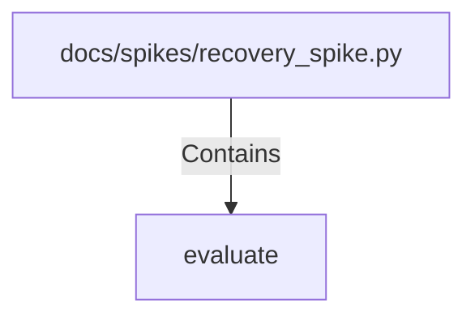

# evaluate (PythonSymbol)

## Properties

| Key | Value |
|---|---|
| `kind` | function |

## Relationships

### Contains

- ← docs/spikes/recovery_spike.py (`549420d0-5d13-5b9c-ae3d-7138b5740139`)

## Diagram

## Evidence

_No evidence cited._
