# doc/entities/crate (Rollup)

## Properties

| Key | Value |
|---|---|
| `boundary_relationships` | {} |
| `components` | {"File":39} |
| `group_key` | dir:doc/entities/crate |
| `member_count` | 39 |

## Relationships

### Contains

- → doc/entities/crate/ek/ekos-plugin-sql-dialect-snowflake.md (`265710ce-dde7-59c7-ae7d-1b4fc849e4e5`) — evidence: doc/entities/crate/ek/ekos-plugin-sql-dialect-snowflake.md is a member of dir:doc/entities/crate
- → doc/entities/crate/ek/ekos-semantic.md (`54094b61-ac1c-5d7b-9b49-37c8485756d8`) — evidence: doc/entities/crate/ek/ekos-semantic.md is a member of dir:doc/entities/crate
- → doc/entities/crate/ek/ekos-integration-tests.md (`b0c3a7bf-56c1-51df-88b5-29e4eb6e4d0f`) — evidence: doc/entities/crate/ek/ekos-integration-tests.md is a member of dir:doc/entities/crate
- → doc/entities/crate/ek/ekos-ekl.md (`bc9a4413-e479-5328-8be3-801f347977de`) — evidence: doc/entities/crate/ek/ekos-ekl.md is a member of dir:doc/entities/crate
- → doc/entities/crate/ek/ekos-plugin-snowflake.md (`88d29329-402d-5c41-b79e-2febe788b97e`) — evidence: doc/entities/crate/ek/ekos-plugin-snowflake.md is a member of dir:doc/entities/crate
- → doc/entities/crate/ek/ekos-plugin-git.md (`112a4b96-8547-5e8b-84dc-e92261eb1f27`) — evidence: doc/entities/crate/ek/ekos-plugin-git.md is a member of dir:doc/entities/crate
- → doc/entities/crate/ek/ekos-scheduler.md (`f5c6f1f1-1620-5c79-bd5b-f624d12e4347`) — evidence: doc/entities/crate/ek/ekos-scheduler.md is a member of dir:doc/entities/crate
- → doc/entities/crate/ek/ekos-ledger.md (`eb7280b8-eac7-5ec6-8e5a-b4661fabca03`) — evidence: doc/entities/crate/ek/ekos-ledger.md is a member of dir:doc/entities/crate
- → doc/entities/crate/ek/ekos-plugin-salesforce.md (`8b3a618f-7d81-5db7-8e36-9df9e00c5851`) — evidence: doc/entities/crate/ek/ekos-plugin-salesforce.md is a member of dir:doc/entities/crate
- → doc/entities/crate/ek/ekos-plugin-sql-dialect-mysql.md (`a5f42826-b274-53e3-a497-9f91657bb17c`) — evidence: doc/entities/crate/ek/ekos-plugin-sql-dialect-mysql.md is a member of dir:doc/entities/crate
- → doc/entities/crate/ek/ekos-docs-gen.md (`b1a5bcf4-5840-5fb5-a484-b059dc85d1da`) — evidence: doc/entities/crate/ek/ekos-docs-gen.md is a member of dir:doc/entities/crate
- → doc/entities/crate/ek/ekos-plugin-fabric.md (`f276130a-7dcc-552d-9c8e-e0c6718173f0`) — evidence: doc/entities/crate/ek/ekos-plugin-fabric.md is a member of dir:doc/entities/crate
- → doc/entities/crate/ek/ekos-plugin-sql-dialect-postgres.md (`625eae45-b36a-55e8-a063-1816d5e8c1e0`) — evidence: doc/entities/crate/ek/ekos-plugin-sql-dialect-postgres.md is a member of dir:doc/entities/crate
- → doc/entities/crate/ek/ekos-plugin-github.md (`b42b90ce-1fc0-526a-991f-0b2ad256f001`) — evidence: doc/entities/crate/ek/ekos-plugin-github.md is a member of dir:doc/entities/crate
- → doc/entities/crate/ek/ekos-artifact.md (`ece44ce3-9997-563c-86ab-1fd192e9c703`) — evidence: doc/entities/crate/ek/ekos-artifact.md is a member of dir:doc/entities/crate
- → doc/entities/crate/ek/ekos-marketing.md (`9487c6db-0cd4-5f3f-b05c-7975c9e62990`) — evidence: doc/entities/crate/ek/ekos-marketing.md is a member of dir:doc/entities/crate
- → doc/entities/crate/ek/ekos-common.md (`b1b8df09-d789-5e47-acc6-a91b5b168a8e`) — evidence: doc/entities/crate/ek/ekos-common.md is a member of dir:doc/entities/crate
- → doc/entities/crate/ek/ekos-plugin-sap.md (`7cbfd5c5-f981-5f43-a9a0-e042b61f75e4`) — evidence: doc/entities/crate/ek/ekos-plugin-sap.md is a member of dir:doc/entities/crate
- → doc/entities/crate/ek/ekos-plugin-oracle.md (`74addbd7-b212-5257-9ffc-e64c8b11ca21`) — evidence: doc/entities/crate/ek/ekos-plugin-oracle.md is a member of dir:doc/entities/crate
- → doc/entities/crate/ek/ekos-identity.md (`254b5490-1924-5472-a7d9-b480c2da831f`) — evidence: doc/entities/crate/ek/ekos-identity.md is a member of dir:doc/entities/crate
- → doc/entities/crate/ek/ekos-plugin-crypto.md (`f5f0333e-4aa9-5f81-8875-603668cd70d1`) — evidence: doc/entities/crate/ek/ekos-plugin-crypto.md is a member of dir:doc/entities/crate
- → doc/entities/crate/ek/ekos-compiler-sdk.md (`4a785175-5d79-51b2-b843-c32ff5f796e3`) — evidence: doc/entities/crate/ek/ekos-compiler-sdk.md is a member of dir:doc/entities/crate
- → doc/entities/crate/ek/ekos-plugin-pentaho.md (`544d384d-bd0a-55fe-8d93-d918e0f0cb1b`) — evidence: doc/entities/crate/ek/ekos-plugin-pentaho.md is a member of dir:doc/entities/crate
- → doc/entities/crate/ek/ekos-plugin-confluence.md (`6d1605db-0e64-5d42-8c87-90e8808cfc79`) — evidence: doc/entities/crate/ek/ekos-plugin-confluence.md is a member of dir:doc/entities/crate
- → doc/entities/crate/ek/ekos.md (`d2f4c82a-ef4a-5f38-b516-b8715a47e9a1`) — evidence: doc/entities/crate/ek/ekos.md is a member of dir:doc/entities/crate
- → doc/entities/crate/ek/ekos-plugin-sql-dialect-databricks.md (`ed05aa43-372b-52dd-885b-6f65505f7c77`) — evidence: doc/entities/crate/ek/ekos-plugin-sql-dialect-databricks.md is a member of dir:doc/entities/crate
- → doc/entities/crate/ek/ekos-plugin-python.md (`56161d8d-1296-54ca-b0ab-a9ad1073a9e2`) — evidence: doc/entities/crate/ek/ekos-plugin-python.md is a member of dir:doc/entities/crate
- → doc/entities/crate/ek/ekos-recovery.md (`487bb84e-92ce-58dd-839c-2dac9eb83f96`) — evidence: doc/entities/crate/ek/ekos-recovery.md is a member of dir:doc/entities/crate
- → doc/entities/crate/ek/ekos-plugin-rust.md (`78977d5a-08f7-5b43-90b8-f8dd9e5daa4c`) — evidence: doc/entities/crate/ek/ekos-plugin-rust.md is a member of dir:doc/entities/crate
- → doc/entities/crate/ek/ekos-observation-sdk.md (`5f2f237b-c66f-579d-a508-3e38cb61f73d`) — evidence: doc/entities/crate/ek/ekos-observation-sdk.md is a member of dir:doc/entities/crate
- → doc/entities/crate/ek/ekos-plugin-localdocs.md (`1f32f7e3-fe19-5041-82bd-18e4e5716580`) — evidence: doc/entities/crate/ek/ekos-plugin-localdocs.md is a member of dir:doc/entities/crate
- → doc/entities/crate/ek/ekos-compiler-core.md (`ab2dc1f4-f876-543f-91b0-ac8d347c99a5`) — evidence: doc/entities/crate/ek/ekos-compiler-core.md is a member of dir:doc/entities/crate
- → doc/entities/crate/ek/ekos-plugin-file.md (`315591a6-4787-58bf-bebc-12c768ae2200`) — evidence: doc/entities/crate/ek/ekos-plugin-file.md is a member of dir:doc/entities/crate
- → doc/entities/crate/ek/ekos-sql-dialect-sdk.md (`cee51636-66ea-5e02-8fa5-2bb24ede052c`) — evidence: doc/entities/crate/ek/ekos-sql-dialect-sdk.md is a member of dir:doc/entities/crate
- → doc/entities/crate/ek/ekos-kir.md (`0cfd81a8-54ce-54f0-8c60-353878a5ea13`) — evidence: doc/entities/crate/ek/ekos-kir.md is a member of dir:doc/entities/crate
- → doc/entities/crate/ek/ekos-runtime.md (`818b9b97-088c-5ace-b717-7eec3fee6713`) — evidence: doc/entities/crate/ek/ekos-runtime.md is a member of dir:doc/entities/crate
- → doc/entities/crate/ek/ekos-benchmark.md (`022f4ee5-35f4-5dc1-9045-6600698f88f1`) — evidence: doc/entities/crate/ek/ekos-benchmark.md is a member of dir:doc/entities/crate
- → doc/entities/crate/ek/ekos-plugin-sql-dialect-mssql.md (`1e212ba5-8b44-5738-92c7-d10a9f5f6135`) — evidence: doc/entities/crate/ek/ekos-plugin-sql-dialect-mssql.md is a member of dir:doc/entities/crate
- → doc/entities/crate/ek/ekos-dbt-gen.md (`48f0cbc7-18c0-5461-8f01-c25fd3edec57`) — evidence: doc/entities/crate/ek/ekos-dbt-gen.md is a member of dir:doc/entities/crate

## Diagram

```mermaid
graph TD
    n5cfcb7eaa5bb5037902520085245ee17["doc/entities/crate"]
    n265710cedde759c7ae7d1b4fc849e4e5["doc/entities/crate/ek/ekos-plugin-sql-dialect-snowflake.md"]
    n5cfcb7eaa5bb5037902520085245ee17 -->|Contains| n265710cedde759c7ae7d1b4fc849e4e5
    n54094b61ac1c5d7b9b4937c8485756d8["doc/entities/crate/ek/ekos-semantic.md"]
    n5cfcb7eaa5bb5037902520085245ee17 -->|Contains| n54094b61ac1c5d7b9b4937c8485756d8
    nb0c3a7bf56c151df88b529e4eb6e4d0f["doc/entities/crate/ek/ekos-integration-tests.md"]
    n5cfcb7eaa5bb5037902520085245ee17 -->|Contains| nb0c3a7bf56c151df88b529e4eb6e4d0f
    nbc9a4413e47953288be3801f347977de["doc/entities/crate/ek/ekos-ekl.md"]
    n5cfcb7eaa5bb5037902520085245ee17 -->|Contains| nbc9a4413e47953288be3801f347977de
    n88d29329402d5c41b79e2febe788b97e["doc/entities/crate/ek/ekos-plugin-snowflake.md"]
    n5cfcb7eaa5bb5037902520085245ee17 -->|Contains| n88d29329402d5c41b79e2febe788b97e
    n112a4b9685475e8b84dce92261eb1f27["doc/entities/crate/ek/ekos-plugin-git.md"]
    n5cfcb7eaa5bb5037902520085245ee17 -->|Contains| n112a4b9685475e8b84dce92261eb1f27
    nf5c6f1f116205c79bd5bf624d12e4347["doc/entities/crate/ek/ekos-scheduler.md"]
    n5cfcb7eaa5bb5037902520085245ee17 -->|Contains| nf5c6f1f116205c79bd5bf624d12e4347
    neb7280b8eac75ec68e5ab4661fabca03["doc/entities/crate/ek/ekos-ledger.md"]
    n5cfcb7eaa5bb5037902520085245ee17 -->|Contains| neb7280b8eac75ec68e5ab4661fabca03
    n8b3a618f7d815db78e369df9e00c5851["doc/entities/crate/ek/ekos-plugin-salesforce.md"]
    n5cfcb7eaa5bb5037902520085245ee17 -->|Contains| n8b3a618f7d815db78e369df9e00c5851
    na5f42826b27453e3a4979f91657bb17c["doc/entities/crate/ek/ekos-plugin-sql-dialect-mysql.md"]
    n5cfcb7eaa5bb5037902520085245ee17 -->|Contains| na5f42826b27453e3a4979f91657bb17c
    nb1a5bcf458405fb5a484b059dc85d1da["doc/entities/crate/ek/ekos-docs-gen.md"]
    n5cfcb7eaa5bb5037902520085245ee17 -->|Contains| nb1a5bcf458405fb5a484b059dc85d1da
    nf276130a7dcc552d9c8ee0c6718173f0["doc/entities/crate/ek/ekos-plugin-fabric.md"]
    n5cfcb7eaa5bb5037902520085245ee17 -->|Contains| nf276130a7dcc552d9c8ee0c6718173f0
    n625eae45b36a55e8a0631816d5e8c1e0["doc/entities/crate/ek/ekos-plugin-sql-dialect-postgres.md"]
    n5cfcb7eaa5bb5037902520085245ee17 -->|Contains| n625eae45b36a55e8a0631816d5e8c1e0
    nb42b90ce1fc0526a991f0b2ad256f001["doc/entities/crate/ek/ekos-plugin-github.md"]
    n5cfcb7eaa5bb5037902520085245ee17 -->|Contains| nb42b90ce1fc0526a991f0b2ad256f001
    nece44ce39997563c86ab1fd192e9c703["doc/entities/crate/ek/ekos-artifact.md"]
    n5cfcb7eaa5bb5037902520085245ee17 -->|Contains| nece44ce39997563c86ab1fd192e9c703
    n9487c6db0cd45f3fb05c7975c9e62990["doc/entities/crate/ek/ekos-marketing.md"]
    n5cfcb7eaa5bb5037902520085245ee17 -->|Contains| n9487c6db0cd45f3fb05c7975c9e62990
    nb1b8df09d7895e47acc6a91b5b168a8e["doc/entities/crate/ek/ekos-common.md"]
    n5cfcb7eaa5bb5037902520085245ee17 -->|Contains| nb1b8df09d7895e47acc6a91b5b168a8e
    n7cbfd5c5f9815f43a9a0e042b61f75e4["doc/entities/crate/ek/ekos-plugin-sap.md"]
    n5cfcb7eaa5bb5037902520085245ee17 -->|Contains| n7cbfd5c5f9815f43a9a0e042b61f75e4
    n74addbd7b21252579ffce64c8b11ca21["doc/entities/crate/ek/ekos-plugin-oracle.md"]
    n5cfcb7eaa5bb5037902520085245ee17 -->|Contains| n74addbd7b21252579ffce64c8b11ca21
    n254b549019245472a7d9b480c2da831f["doc/entities/crate/ek/ekos-identity.md"]
    n5cfcb7eaa5bb5037902520085245ee17 -->|Contains| n254b549019245472a7d9b480c2da831f
    nf5f0333e4aa95f818875603668cd70d1["doc/entities/crate/ek/ekos-plugin-crypto.md"]
    n5cfcb7eaa5bb5037902520085245ee17 -->|Contains| nf5f0333e4aa95f818875603668cd70d1
    n4a7851755d7951b2b843c32ff5f796e3["doc/entities/crate/ek/ekos-compiler-sdk.md"]
    n5cfcb7eaa5bb5037902520085245ee17 -->|Contains| n4a7851755d7951b2b843c32ff5f796e3
    n544d384dbd0a55fe8d93d918e0f0cb1b["doc/entities/crate/ek/ekos-plugin-pentaho.md"]
    n5cfcb7eaa5bb5037902520085245ee17 -->|Contains| n544d384dbd0a55fe8d93d918e0f0cb1b
    n6d1605db0e645d428c8790e8808cfc79["doc/entities/crate/ek/ekos-plugin-confluence.md"]
    n5cfcb7eaa5bb5037902520085245ee17 -->|Contains| n6d1605db0e645d428c8790e8808cfc79
    nd2f4c82aef4a5f38b516b8715a47e9a1["doc/entities/crate/ek/ekos.md"]
    n5cfcb7eaa5bb5037902520085245ee17 -->|Contains| nd2f4c82aef4a5f38b516b8715a47e9a1
    ned05aa43372b52dd885b6f65505f7c77["doc/entities/crate/ek/ekos-plugin-sql-dialect-databricks.md"]
    n5cfcb7eaa5bb5037902520085245ee17 -->|Contains| ned05aa43372b52dd885b6f65505f7c77
    n56161d8d129654cab0aba9ad1073a9e2["doc/entities/crate/ek/ekos-plugin-python.md"]
    n5cfcb7eaa5bb5037902520085245ee17 -->|Contains| n56161d8d129654cab0aba9ad1073a9e2
    n487bb84e92ce58dd839c2dac9eb83f96["doc/entities/crate/ek/ekos-recovery.md"]
    n5cfcb7eaa5bb5037902520085245ee17 -->|Contains| n487bb84e92ce58dd839c2dac9eb83f96
    n78977d5a08f75b4390b8f8dd9e5daa4c["doc/entities/crate/ek/ekos-plugin-rust.md"]
    n5cfcb7eaa5bb5037902520085245ee17 -->|Contains| n78977d5a08f75b4390b8f8dd9e5daa4c
    n5f2f237bc66f579da5083e38cb61f73d["doc/entities/crate/ek/ekos-observation-sdk.md"]
    n5cfcb7eaa5bb5037902520085245ee17 -->|Contains| n5f2f237bc66f579da5083e38cb61f73d
    n1f32f7e3fe19504182bd18e4e5716580["doc/entities/crate/ek/ekos-plugin-localdocs.md"]
    n5cfcb7eaa5bb5037902520085245ee17 -->|Contains| n1f32f7e3fe19504182bd18e4e5716580
    nab2dc1f4f876543f91b0ac8d347c99a5["doc/entities/crate/ek/ekos-compiler-core.md"]
    n5cfcb7eaa5bb5037902520085245ee17 -->|Contains| nab2dc1f4f876543f91b0ac8d347c99a5
    n315591a6478758bfbebc12c768ae2200["doc/entities/crate/ek/ekos-plugin-file.md"]
    n5cfcb7eaa5bb5037902520085245ee17 -->|Contains| n315591a6478758bfbebc12c768ae2200
    ncee5163666ea5e028fa52bb24ede052c["doc/entities/crate/ek/ekos-sql-dialect-sdk.md"]
    n5cfcb7eaa5bb5037902520085245ee17 -->|Contains| ncee5163666ea5e028fa52bb24ede052c
    n0cfd81a854ce54f08c60353878a5ea13["doc/entities/crate/ek/ekos-kir.md"]
    n5cfcb7eaa5bb5037902520085245ee17 -->|Contains| n0cfd81a854ce54f08c60353878a5ea13
    n818b9b97088c5aceb7177eec3fee6713["doc/entities/crate/ek/ekos-runtime.md"]
    n5cfcb7eaa5bb5037902520085245ee17 -->|Contains| n818b9b97088c5aceb7177eec3fee6713
    n022f4ee535f45dc190456600698f88f1["doc/entities/crate/ek/ekos-benchmark.md"]
    n5cfcb7eaa5bb5037902520085245ee17 -->|Contains| n022f4ee535f45dc190456600698f88f1
    n1e212ba58b44573892c7d10a9f5f6135["doc/entities/crate/ek/ekos-plugin-sql-dialect-mssql.md"]
    n5cfcb7eaa5bb5037902520085245ee17 -->|Contains| n1e212ba58b44573892c7d10a9f5f6135
    n48f0cbc718c054618f01c25fd3edec57["doc/entities/crate/ek/ekos-dbt-gen.md"]
    n5cfcb7eaa5bb5037902520085245ee17 -->|Contains| n48f0cbc718c054618f01c25fd3edec57
```

## Evidence

- `c42ffe5b-09ac-4148-9249-553883f11361` — doc/entities/crate/ek/ekos-plugin-sql-dialect-snowflake.md is a member of dir:doc/entities/crate (confidence: 1.00)
- `77006010-cc35-4781-b8ac-a8b27b1ea480` — doc/entities/crate/ek/ekos-semantic.md is a member of dir:doc/entities/crate (confidence: 1.00)
- `d007c4e0-0121-4005-9a85-71bd3b5bbbf0` — doc/entities/crate/ek/ekos-integration-tests.md is a member of dir:doc/entities/crate (confidence: 1.00)
- `ed245f29-afbd-45dd-aac2-082807de3652` — doc/entities/crate/ek/ekos-ekl.md is a member of dir:doc/entities/crate (confidence: 1.00)
- `0b1c7d31-006d-462c-a65e-55e46cae4245` — doc/entities/crate/ek/ekos-plugin-snowflake.md is a member of dir:doc/entities/crate (confidence: 1.00)
- `63979a6e-73e1-4899-8287-9beebc82be5d` — doc/entities/crate/ek/ekos-plugin-git.md is a member of dir:doc/entities/crate (confidence: 1.00)
- `fa0f7a33-fc82-4921-9a47-4023b763ca17` — doc/entities/crate/ek/ekos-scheduler.md is a member of dir:doc/entities/crate (confidence: 1.00)
- `ea9fee71-3ada-4fcb-b750-d8936bd21645` — doc/entities/crate/ek/ekos-ledger.md is a member of dir:doc/entities/crate (confidence: 1.00)
- `638e2700-1b99-4eed-99d0-827b012beee8` — doc/entities/crate/ek/ekos-plugin-salesforce.md is a member of dir:doc/entities/crate (confidence: 1.00)
- `99d7ad13-a9e2-4c89-816b-125fabc977c2` — doc/entities/crate/ek/ekos-plugin-sql-dialect-mysql.md is a member of dir:doc/entities/crate (confidence: 1.00)
- `dbc5f38e-3d52-4f68-8964-5674e170084d` — doc/entities/crate/ek/ekos-docs-gen.md is a member of dir:doc/entities/crate (confidence: 1.00)
- `73867f72-945a-4bb6-b41d-1b26f8beb5a3` — doc/entities/crate/ek/ekos-plugin-fabric.md is a member of dir:doc/entities/crate (confidence: 1.00)
- `bcd47ef8-f81f-43c1-9775-be510a585e86` — doc/entities/crate/ek/ekos-plugin-sql-dialect-postgres.md is a member of dir:doc/entities/crate (confidence: 1.00)
- `4481c412-05a5-40fa-8a59-b8df6f0ae9fa` — doc/entities/crate/ek/ekos-plugin-github.md is a member of dir:doc/entities/crate (confidence: 1.00)
- `d266c3dc-a283-4a78-9ab0-4d96c2dbe3e5` — doc/entities/crate/ek/ekos-artifact.md is a member of dir:doc/entities/crate (confidence: 1.00)
- `341395f9-f30a-4e93-894a-b3367546015c` — doc/entities/crate/ek/ekos-marketing.md is a member of dir:doc/entities/crate (confidence: 1.00)
- `6403a206-b9db-46e3-8893-75fc0cae09d7` — doc/entities/crate/ek/ekos-common.md is a member of dir:doc/entities/crate (confidence: 1.00)
- `a181fb34-ce53-413a-9e2b-6f10b81514e9` — doc/entities/crate/ek/ekos-plugin-sap.md is a member of dir:doc/entities/crate (confidence: 1.00)
- `309d5c5d-4c49-47b1-a02b-739213d53e61` — doc/entities/crate/ek/ekos-plugin-oracle.md is a member of dir:doc/entities/crate (confidence: 1.00)
- `b6608213-06ad-4859-8689-fd4acfcea7f4` — doc/entities/crate/ek/ekos-identity.md is a member of dir:doc/entities/crate (confidence: 1.00)
- `8de92bd6-580b-49d2-865b-d46ddfd91df8` — doc/entities/crate/ek/ekos-plugin-crypto.md is a member of dir:doc/entities/crate (confidence: 1.00)
- `8add7338-4c1d-45c1-82c9-2399220d260e` — doc/entities/crate/ek/ekos-compiler-sdk.md is a member of dir:doc/entities/crate (confidence: 1.00)
- `42ab44e9-f977-4b63-a5c7-74f22a36ed10` — doc/entities/crate/ek/ekos-plugin-pentaho.md is a member of dir:doc/entities/crate (confidence: 1.00)
- `d414534e-7f62-46a2-bc4f-df1265444d2f` — doc/entities/crate/ek/ekos-plugin-confluence.md is a member of dir:doc/entities/crate (confidence: 1.00)
- `cccb3b2b-da52-4500-8736-05c3271fe245` — doc/entities/crate/ek/ekos.md is a member of dir:doc/entities/crate (confidence: 1.00)
- `0f21d6ca-26fd-4f21-bbb1-4c8ca93f1acf` — doc/entities/crate/ek/ekos-plugin-sql-dialect-databricks.md is a member of dir:doc/entities/crate (confidence: 1.00)
- `c84664fa-0bc8-424f-8b23-0eddf37c6d61` — doc/entities/crate/ek/ekos-plugin-python.md is a member of dir:doc/entities/crate (confidence: 1.00)
- `b20ae1fb-2c78-42ff-97fe-b279fcf96e73` — doc/entities/crate/ek/ekos-recovery.md is a member of dir:doc/entities/crate (confidence: 1.00)
- `3eeae597-712e-443c-8e51-95d21ff0f053` — doc/entities/crate/ek/ekos-plugin-rust.md is a member of dir:doc/entities/crate (confidence: 1.00)
- `bdbc1301-9afe-4bad-b1db-3b53ee6f6b16` — doc/entities/crate/ek/ekos-observation-sdk.md is a member of dir:doc/entities/crate (confidence: 1.00)
- `50b5cfb6-8014-40ca-be98-340de925b9f2` — doc/entities/crate/ek/ekos-plugin-localdocs.md is a member of dir:doc/entities/crate (confidence: 1.00)
- `259f9fa9-99d2-41e1-b28d-87569206b1b1` — doc/entities/crate/ek/ekos-compiler-core.md is a member of dir:doc/entities/crate (confidence: 1.00)
- `a0acf3f3-c3e2-4999-98ab-8c92bf9615aa` — doc/entities/crate/ek/ekos-plugin-file.md is a member of dir:doc/entities/crate (confidence: 1.00)
- `4e815b81-8e87-4804-8460-7c3f5c5c7468` — doc/entities/crate/ek/ekos-sql-dialect-sdk.md is a member of dir:doc/entities/crate (confidence: 1.00)
- `854d9ba1-17ba-4e35-93d5-e3c3680c62c2` — doc/entities/crate/ek/ekos-kir.md is a member of dir:doc/entities/crate (confidence: 1.00)
- `c75fa8b5-72d6-485a-b138-68e63ae4f2cc` — doc/entities/crate/ek/ekos-runtime.md is a member of dir:doc/entities/crate (confidence: 1.00)
- `46f8b553-7f35-4e21-9e53-38a3802fb734` — doc/entities/crate/ek/ekos-benchmark.md is a member of dir:doc/entities/crate (confidence: 1.00)
- `de47bb41-7110-4057-98c2-8348d7a1241f` — doc/entities/crate/ek/ekos-plugin-sql-dialect-mssql.md is a member of dir:doc/entities/crate (confidence: 1.00)
- `20855a75-cc84-4d75-be4b-5f54df5a2997` — doc/entities/crate/ek/ekos-dbt-gen.md is a member of dir:doc/entities/crate (confidence: 1.00)
