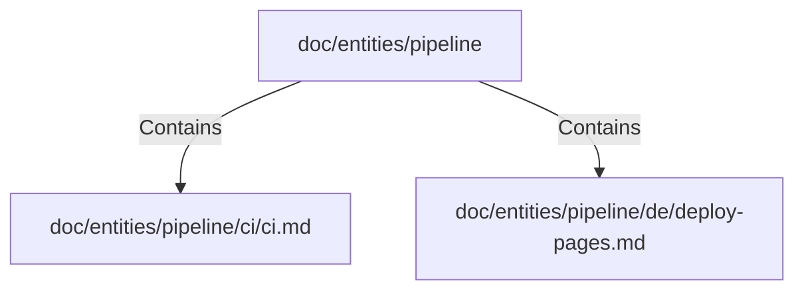

# doc/entities/pipeline (Rollup)

## Properties

| Key | Value |
|---|---|
| `boundary_relationships` | {} |
| `components` | {"File":2} |
| `group_key` | dir:doc/entities/pipeline |
| `member_count` | 2 |

## Relationships

### Contains

- → doc/entities/pipeline/ci/ci.md (`8620f7c8-ea04-595e-9c1b-bc389d8c3d3d`) — evidence: doc/entities/pipeline/ci/ci.md is a member of dir:doc/entities/pipeline
- → doc/entities/pipeline/de/deploy-pages.md (`22af9ecb-e71d-5bf5-8762-48ca5f50760a`) — evidence: doc/entities/pipeline/de/deploy-pages.md is a member of dir:doc/entities/pipeline

## Diagram

## Evidence

- `4822910a-c4b1-4b2c-be2b-026d7811e4f6` — doc/entities/pipeline/ci/ci.md is a member of dir:doc/entities/pipeline (confidence: 1.00)
- `5e8ff297-799d-4845-8470-4fdfa588272e` — doc/entities/pipeline/de/deploy-pages.md is a member of dir:doc/entities/pipeline (confidence: 1.00)
