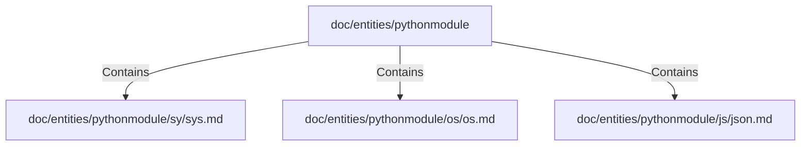

# doc/entities/pythonmodule (Rollup)

## Properties

| Key | Value |
|---|---|
| `boundary_relationships` | {} |
| `components` | {"File":3} |
| `group_key` | dir:doc/entities/pythonmodule |
| `member_count` | 3 |

## Relationships

### Contains

- → doc/entities/pythonmodule/sy/sys.md (`0a559397-737e-55a8-b75b-2c4e94c05d99`) — evidence: doc/entities/pythonmodule/sy/sys.md is a member of dir:doc/entities/pythonmodule
- → doc/entities/pythonmodule/os/os.md (`6982b474-052b-581a-83fa-8bf4001e9941`) — evidence: doc/entities/pythonmodule/os/os.md is a member of dir:doc/entities/pythonmodule
- → doc/entities/pythonmodule/js/json.md (`4e0b409f-a739-54b1-8650-bff24fb44b4c`) — evidence: doc/entities/pythonmodule/js/json.md is a member of dir:doc/entities/pythonmodule

## Diagram

## Evidence

- `542152c3-3a31-4db2-8938-2ccb4c0d3e54` — doc/entities/pythonmodule/sy/sys.md is a member of dir:doc/entities/pythonmodule (confidence: 1.00)
- `4a663515-f4c1-4979-8a91-4d3fabc21332` — doc/entities/pythonmodule/os/os.md is a member of dir:doc/entities/pythonmodule (confidence: 1.00)
- `db855aff-ad6f-42a6-a4f2-4161a99ace42` — doc/entities/pythonmodule/js/json.md is a member of dir:doc/entities/pythonmodule (confidence: 1.00)
