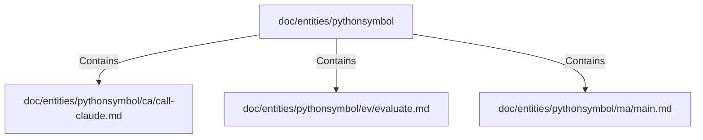

# doc/entities/pythonsymbol (Rollup)

## Properties

| Key | Value |
|---|---|
| `boundary_relationships` | {} |
| `components` | {"File":3} |
| `group_key` | dir:doc/entities/pythonsymbol |
| `member_count` | 3 |

## Relationships

### Contains

- → doc/entities/pythonsymbol/ca/call-claude.md (`23a3b5d5-951d-56fc-a2d8-47c3d75dda28`) — evidence: doc/entities/pythonsymbol/ca/call-claude.md is a member of dir:doc/entities/pythonsymbol
- → doc/entities/pythonsymbol/ev/evaluate.md (`e5e73c44-222d-5a2d-9aa3-245fbe61867e`) — evidence: doc/entities/pythonsymbol/ev/evaluate.md is a member of dir:doc/entities/pythonsymbol
- → doc/entities/pythonsymbol/ma/main.md (`97d1aed0-2181-5192-ad0f-6efbbed55e79`) — evidence: doc/entities/pythonsymbol/ma/main.md is a member of dir:doc/entities/pythonsymbol

## Diagram

## Evidence

- `463a9a65-057f-40bd-820a-75a32b365ab3` — doc/entities/pythonsymbol/ca/call-claude.md is a member of dir:doc/entities/pythonsymbol (confidence: 1.00)
- `08fb20e0-32b3-42d8-a9f3-d46ee4ea48fa` — doc/entities/pythonsymbol/ev/evaluate.md is a member of dir:doc/entities/pythonsymbol (confidence: 1.00)
- `78e87700-48da-4028-8edd-fbe7d1252674` — doc/entities/pythonsymbol/ma/main.md is a member of dir:doc/entities/pythonsymbol (confidence: 1.00)
