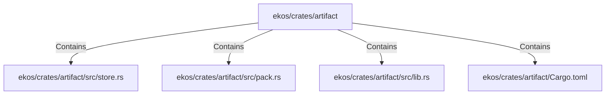

# ekos/crates/artifact (Rollup)

## Properties

| Key | Value |
|---|---|
| `boundary_relationships` | {"Contains":58,"DependsOn":31} |
| `components` | {"File":4} |
| `group_key` | dir:ekos/crates/artifact |
| `member_count` | 4 |

## Relationships

### Contains

- → ekos/crates/artifact/src/store.rs (`d997f78d-b111-570e-b530-510e98c14df8`) — evidence: ekos/crates/artifact/src/store.rs is a member of dir:ekos/crates/artifact
- → ekos/crates/artifact/src/pack.rs (`98cd7507-d9e7-59e3-acfb-c7ffb05d9f73`) — evidence: ekos/crates/artifact/src/pack.rs is a member of dir:ekos/crates/artifact
- → ekos/crates/artifact/src/lib.rs (`918532b1-7390-5128-8de5-faf4f7a91daf`) — evidence: ekos/crates/artifact/src/lib.rs is a member of dir:ekos/crates/artifact
- → ekos/crates/artifact/Cargo.toml (`ec53eab7-e4a6-5a18-8b54-d0d73bf12f83`) — evidence: ekos/crates/artifact/Cargo.toml is a member of dir:ekos/crates/artifact

## Diagram

## Evidence

- `c7e42d9e-9361-488f-b2e7-cc9bc329e2a4` — ekos/crates/artifact/src/store.rs is a member of dir:ekos/crates/artifact (confidence: 1.00)
- `4e2a4139-5a96-4040-b9f9-ba59e1f7e782` — ekos/crates/artifact/src/pack.rs is a member of dir:ekos/crates/artifact (confidence: 1.00)
- `6092770d-bf36-40dd-b877-3b4ad22da596` — ekos/crates/artifact/src/lib.rs is a member of dir:ekos/crates/artifact (confidence: 1.00)
- `319ab5b1-7467-4508-91cf-fc8918b317eb` — ekos/crates/artifact/Cargo.toml is a member of dir:ekos/crates/artifact (confidence: 1.00)
