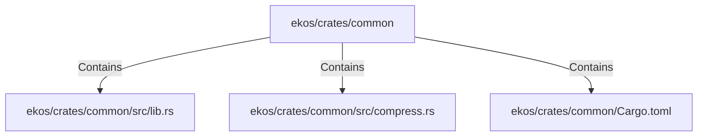

# ekos/crates/common (Rollup)

## Properties

| Key | Value |
|---|---|
| `boundary_relationships` | {"Contains":11,"DependsOn":6} |
| `components` | {"File":3} |
| `group_key` | dir:ekos/crates/common |
| `member_count` | 3 |

## Relationships

### Contains

- → ekos/crates/common/src/lib.rs (`baf41b7a-1ef7-5a05-9152-5eb0218f0896`) — evidence: ekos/crates/common/src/lib.rs is a member of dir:ekos/crates/common
- → ekos/crates/common/src/compress.rs (`99637da4-0489-5fca-ba15-b1144f48c3cc`) — evidence: ekos/crates/common/src/compress.rs is a member of dir:ekos/crates/common
- → ekos/crates/common/Cargo.toml (`64e6073b-fc7d-5613-a431-e54bd2b800f5`) — evidence: ekos/crates/common/Cargo.toml is a member of dir:ekos/crates/common

## Diagram

## Evidence

- `ed9fc50f-5558-46b2-a65b-5f321e7d2a53` — ekos/crates/common/src/lib.rs is a member of dir:ekos/crates/common (confidence: 1.00)
- `1eeff782-79ff-45ee-b06c-72d2e53ca776` — ekos/crates/common/src/compress.rs is a member of dir:ekos/crates/common (confidence: 1.00)
- `48b9a565-e8ea-43b5-a3d3-f8805e641114` — ekos/crates/common/Cargo.toml is a member of dir:ekos/crates/common (confidence: 1.00)
