# ekos/crates/compiler-core (Rollup)

## Properties

| Key | Value |
|---|---|
| `boundary_relationships` | {"Contains":91,"CoupledWith":15,"DependsOn":51} |
| `components` | {"File":8} |
| `group_key` | dir:ekos/crates/compiler-core |
| `member_count` | 8 |

## Relationships

### Contains

- → ekos/crates/compiler-core/src/compiler.rs (`3b7209fe-32c4-588e-b8b5-5fa2165ff88b`) — evidence: ekos/crates/compiler-core/src/compiler.rs is a member of dir:ekos/crates/compiler-core
- → ekos/crates/compiler-core/src/pass.rs (`5189d0a2-3e2b-529e-adbf-3984a77be404`) — evidence: ekos/crates/compiler-core/src/pass.rs is a member of dir:ekos/crates/compiler-core
- → ekos/crates/compiler-core/src/cache.rs (`01ec80b2-6c80-5000-979c-acb288ff920a`) — evidence: ekos/crates/compiler-core/src/cache.rs is a member of dir:ekos/crates/compiler-core
- → ekos/crates/compiler-core/src/diagnostics.rs (`e5b5b2e0-3763-5cb8-a914-f113bb9e3ac4`) — evidence: ekos/crates/compiler-core/src/diagnostics.rs is a member of dir:ekos/crates/compiler-core
- → ekos/crates/compiler-core/src/config.rs (`d0747f34-25e1-5426-80eb-a54fffcac598`) — evidence: ekos/crates/compiler-core/src/config.rs is a member of dir:ekos/crates/compiler-core
- → ekos/crates/compiler-core/src/lib.rs (`a867fdd7-260a-509d-8907-1c5a78ba2027`) — evidence: ekos/crates/compiler-core/src/lib.rs is a member of dir:ekos/crates/compiler-core
- → ekos/crates/compiler-core/src/scheduler.rs (`973894db-35d2-59ed-b82c-30ad335125cf`) — evidence: ekos/crates/compiler-core/src/scheduler.rs is a member of dir:ekos/crates/compiler-core
- → ekos/crates/compiler-core/Cargo.toml (`5524ffc2-48ff-56c1-90dc-d297f0b2cf15`) — evidence: ekos/crates/compiler-core/Cargo.toml is a member of dir:ekos/crates/compiler-core

## Diagram

```mermaid
graph TD
    nb4f46ecbf2d859ce9228c49bd86d625c["ekos/crates/compiler-core"]
    n3b7209fe32c4588eb8b55fa2165ff88b["ekos/crates/compiler-core/src/compiler.rs"]
    nb4f46ecbf2d859ce9228c49bd86d625c -->|Contains| n3b7209fe32c4588eb8b55fa2165ff88b
    n5189d0a23e2b529eadbf3984a77be404["ekos/crates/compiler-core/src/pass.rs"]
    nb4f46ecbf2d859ce9228c49bd86d625c -->|Contains| n5189d0a23e2b529eadbf3984a77be404
    n01ec80b26c805000979cacb288ff920a["ekos/crates/compiler-core/src/cache.rs"]
    nb4f46ecbf2d859ce9228c49bd86d625c -->|Contains| n01ec80b26c805000979cacb288ff920a
    ne5b5b2e037635cb8a914f113bb9e3ac4["ekos/crates/compiler-core/src/diagnostics.rs"]
    nb4f46ecbf2d859ce9228c49bd86d625c -->|Contains| ne5b5b2e037635cb8a914f113bb9e3ac4
    nd0747f3425e1542680eba54fffcac598["ekos/crates/compiler-core/src/config.rs"]
    nb4f46ecbf2d859ce9228c49bd86d625c -->|Contains| nd0747f3425e1542680eba54fffcac598
    na867fdd7260a509d89071c5a78ba2027["ekos/crates/compiler-core/src/lib.rs"]
    nb4f46ecbf2d859ce9228c49bd86d625c -->|Contains| na867fdd7260a509d89071c5a78ba2027
    n973894db35d259edb82c30ad335125cf["ekos/crates/compiler-core/src/scheduler.rs"]
    nb4f46ecbf2d859ce9228c49bd86d625c -->|Contains| n973894db35d259edb82c30ad335125cf
    n5524ffc248ff56c190dcd297f0b2cf15["ekos/crates/compiler-core/Cargo.toml"]
    nb4f46ecbf2d859ce9228c49bd86d625c -->|Contains| n5524ffc248ff56c190dcd297f0b2cf15
```

## Evidence

- `fa8ea561-4151-41af-8bd9-8805eb110b79` — ekos/crates/compiler-core/src/compiler.rs is a member of dir:ekos/crates/compiler-core (confidence: 1.00)
- `ae923438-7cb8-4f6b-9b81-7dbf0efff660` — ekos/crates/compiler-core/src/pass.rs is a member of dir:ekos/crates/compiler-core (confidence: 1.00)
- `9c5243c8-86fc-4bd9-af5e-ffca8c3cb990` — ekos/crates/compiler-core/src/cache.rs is a member of dir:ekos/crates/compiler-core (confidence: 1.00)
- `4bb3fa95-614a-4968-af2e-6d6e637f860c` — ekos/crates/compiler-core/src/diagnostics.rs is a member of dir:ekos/crates/compiler-core (confidence: 1.00)
- `9c37598d-9b80-46bc-83e5-aba6f4cb27a7` — ekos/crates/compiler-core/src/config.rs is a member of dir:ekos/crates/compiler-core (confidence: 1.00)
- `0a2a99c7-7074-4b28-af86-cdd6178fb063` — ekos/crates/compiler-core/src/lib.rs is a member of dir:ekos/crates/compiler-core (confidence: 1.00)
- `dcc13744-6333-42d8-85b1-21370b3e8bfc` — ekos/crates/compiler-core/src/scheduler.rs is a member of dir:ekos/crates/compiler-core (confidence: 1.00)
- `a14488ff-ec33-467d-9d35-0bd8d188dde0` — ekos/crates/compiler-core/Cargo.toml is a member of dir:ekos/crates/compiler-core (confidence: 1.00)
