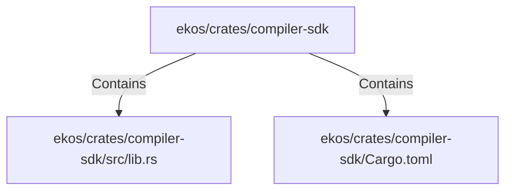

# ekos/crates/compiler-sdk (Rollup)

## Properties

| Key | Value |
|---|---|
| `boundary_relationships` | {"DependsOn":3} |
| `components` | {"File":2} |
| `group_key` | dir:ekos/crates/compiler-sdk |
| `member_count` | 2 |

## Relationships

### Contains

- → ekos/crates/compiler-sdk/src/lib.rs (`15ba2d50-0627-5c11-bb58-392e32c7913e`) — evidence: ekos/crates/compiler-sdk/src/lib.rs is a member of dir:ekos/crates/compiler-sdk
- → ekos/crates/compiler-sdk/Cargo.toml (`20a4d155-8fd5-5fd9-94a0-6540ae324611`) — evidence: ekos/crates/compiler-sdk/Cargo.toml is a member of dir:ekos/crates/compiler-sdk

## Diagram

## Evidence

- `4a9b8553-bd08-400c-b398-806a78fd74a4` — ekos/crates/compiler-sdk/src/lib.rs is a member of dir:ekos/crates/compiler-sdk (confidence: 1.00)
- `1f1a7db7-a8b1-4ca1-9e5c-8d47b4b95584` — ekos/crates/compiler-sdk/Cargo.toml is a member of dir:ekos/crates/compiler-sdk (confidence: 1.00)
