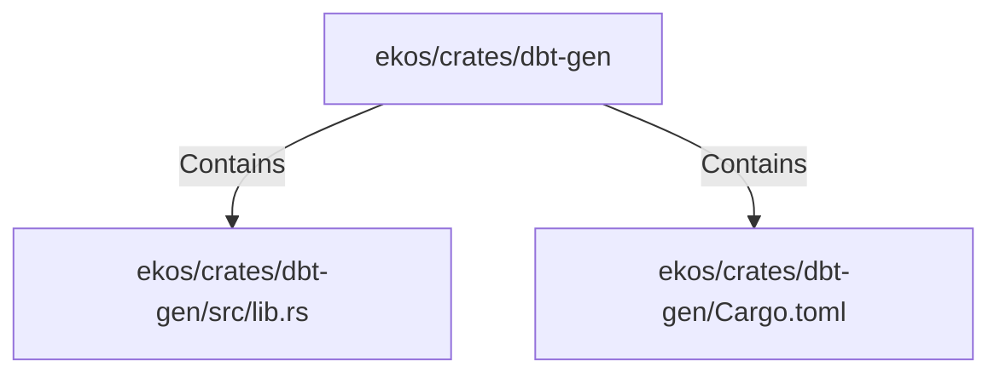

# ekos/crates/dbt-gen (Rollup)

## Properties

| Key | Value |
|---|---|
| `boundary_relationships` | {"Contains":22,"CoupledWith":1,"DependsOn":6} |
| `components` | {"File":2} |
| `group_key` | dir:ekos/crates/dbt-gen |
| `member_count` | 2 |

## Relationships

### Contains

- → ekos/crates/dbt-gen/src/lib.rs (`20d45ed0-c411-592d-8034-6486682f898c`) — evidence: ekos/crates/dbt-gen/src/lib.rs is a member of dir:ekos/crates/dbt-gen
- → ekos/crates/dbt-gen/Cargo.toml (`d48422bb-e581-5c0a-88cd-5ca3928ea5bb`) — evidence: ekos/crates/dbt-gen/Cargo.toml is a member of dir:ekos/crates/dbt-gen

## Diagram

## Evidence

- `f85dcff6-d0d6-4c52-bcaf-1627f2ea4d4e` — ekos/crates/dbt-gen/src/lib.rs is a member of dir:ekos/crates/dbt-gen (confidence: 1.00)
- `ee35fe61-ac6f-48e4-8a02-cbd75f755de6` — ekos/crates/dbt-gen/Cargo.toml is a member of dir:ekos/crates/dbt-gen (confidence: 1.00)
