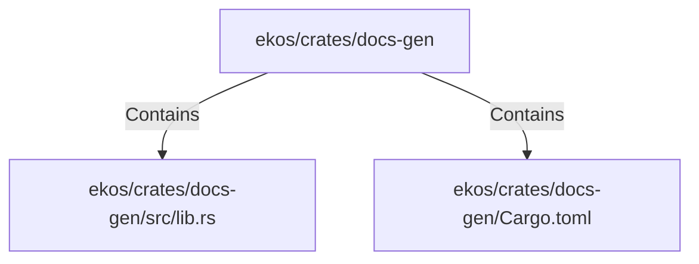

# ekos/crates/docs-gen (Rollup)

## Properties

| Key | Value |
|---|---|
| `boundary_relationships` | {"Contains":40,"CoupledWith":3,"DependsOn":9} |
| `components` | {"File":2} |
| `group_key` | dir:ekos/crates/docs-gen |
| `member_count` | 2 |

## Relationships

### Contains

- → ekos/crates/docs-gen/src/lib.rs (`6ca4fba0-18e5-59b7-9876-7dae72e2ce0e`) — evidence: ekos/crates/docs-gen/src/lib.rs is a member of dir:ekos/crates/docs-gen
- → ekos/crates/docs-gen/Cargo.toml (`695ff876-2df6-5150-8468-c4ce01d48c15`) — evidence: ekos/crates/docs-gen/Cargo.toml is a member of dir:ekos/crates/docs-gen

## Diagram

## Evidence

- `7151529a-d6fa-463d-86ca-ef3c714ec0be` — ekos/crates/docs-gen/src/lib.rs is a member of dir:ekos/crates/docs-gen (confidence: 1.00)
- `2dae0814-8e09-4153-9de7-5f19a6ea163a` — ekos/crates/docs-gen/Cargo.toml is a member of dir:ekos/crates/docs-gen (confidence: 1.00)
