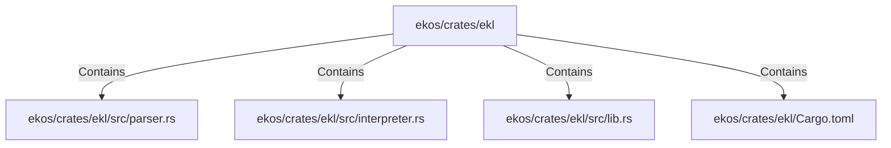

# ekos/crates/ekl (Rollup)

## Properties

| Key | Value |
|---|---|
| `boundary_relationships` | {"Contains":53,"CoupledWith":2,"DependsOn":31} |
| `components` | {"File":4} |
| `group_key` | dir:ekos/crates/ekl |
| `member_count` | 4 |

## Relationships

### Contains

- → ekos/crates/ekl/src/parser.rs (`7eda2531-87c8-5048-92b2-c98483606431`) — evidence: ekos/crates/ekl/src/parser.rs is a member of dir:ekos/crates/ekl
- → ekos/crates/ekl/src/interpreter.rs (`9c2cb6e4-ee09-503f-8cf5-ccfaf23ecd79`) — evidence: ekos/crates/ekl/src/interpreter.rs is a member of dir:ekos/crates/ekl
- → ekos/crates/ekl/src/lib.rs (`848e7f03-56a8-5a5e-a25b-1423213f9e42`) — evidence: ekos/crates/ekl/src/lib.rs is a member of dir:ekos/crates/ekl
- → ekos/crates/ekl/Cargo.toml (`b31ee0b2-7af2-5643-a473-1b20006591e6`) — evidence: ekos/crates/ekl/Cargo.toml is a member of dir:ekos/crates/ekl

## Diagram

## Evidence

- `166b5def-adf9-4caf-b1b7-7e910edd1b8d` — ekos/crates/ekl/src/parser.rs is a member of dir:ekos/crates/ekl (confidence: 1.00)
- `687f1723-9f1a-4ce9-80bc-1b6a947fe85b` — ekos/crates/ekl/src/interpreter.rs is a member of dir:ekos/crates/ekl (confidence: 1.00)
- `bc8db15f-0a28-4bb2-bc07-4ded5a330510` — ekos/crates/ekl/src/lib.rs is a member of dir:ekos/crates/ekl (confidence: 1.00)
- `9e4237af-0add-47bf-bc3f-d02181168aa5` — ekos/crates/ekl/Cargo.toml is a member of dir:ekos/crates/ekl (confidence: 1.00)
