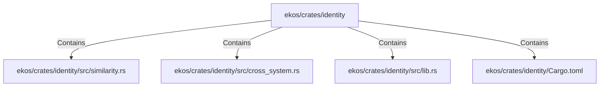

# ekos/crates/identity (Rollup)

## Properties

| Key | Value |
|---|---|
| `boundary_relationships` | {"Contains":37,"CoupledWith":17,"DependsOn":17} |
| `components` | {"File":4} |
| `group_key` | dir:ekos/crates/identity |
| `member_count` | 4 |

## Relationships

### Contains

- → ekos/crates/identity/src/similarity.rs (`e66f3285-3368-5aa7-be23-fe2abc068cad`) — evidence: ekos/crates/identity/src/similarity.rs is a member of dir:ekos/crates/identity
- → ekos/crates/identity/src/cross_system.rs (`44d130a8-ca02-506d-bc1a-21b037fb492c`) — evidence: ekos/crates/identity/src/cross_system.rs is a member of dir:ekos/crates/identity
- → ekos/crates/identity/src/lib.rs (`c958282a-6d42-50ab-9cf9-8533976f0820`) — evidence: ekos/crates/identity/src/lib.rs is a member of dir:ekos/crates/identity
- → ekos/crates/identity/Cargo.toml (`eb1a8094-d4a7-53c0-b566-89b8439d2506`) — evidence: ekos/crates/identity/Cargo.toml is a member of dir:ekos/crates/identity

## Diagram

## Evidence

- `11d07d7a-df21-4694-a11a-2d816d6bd3ee` — ekos/crates/identity/src/similarity.rs is a member of dir:ekos/crates/identity (confidence: 1.00)
- `8a5e9ce0-0412-48fb-8fb2-d1d38733c9f6` — ekos/crates/identity/src/cross_system.rs is a member of dir:ekos/crates/identity (confidence: 1.00)
- `d7a22e15-875d-406d-85a8-ef0ec66e7351` — ekos/crates/identity/src/lib.rs is a member of dir:ekos/crates/identity (confidence: 1.00)
- `360ade22-0937-4c97-b0a6-12321668f1f6` — ekos/crates/identity/Cargo.toml is a member of dir:ekos/crates/identity (confidence: 1.00)
