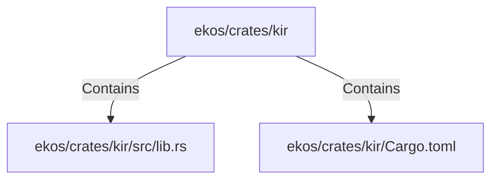

# ekos/crates/kir (Rollup)

## Properties

| Key | Value |
|---|---|
| `boundary_relationships` | {"Contains":34,"CoupledWith":8,"DependsOn":6} |
| `components` | {"File":2} |
| `group_key` | dir:ekos/crates/kir |
| `member_count` | 2 |

## Relationships

### Contains

- → ekos/crates/kir/src/lib.rs (`078a10d5-8141-5e74-b89d-7120ec1be4f8`) — evidence: ekos/crates/kir/src/lib.rs is a member of dir:ekos/crates/kir
- → ekos/crates/kir/Cargo.toml (`9d21a111-dd3f-5173-a4ca-0ff0c8ac3f26`) — evidence: ekos/crates/kir/Cargo.toml is a member of dir:ekos/crates/kir

## Diagram

## Evidence

- `e8267fa1-2d8e-46a5-a7a5-8f70cb7e22a9` — ekos/crates/kir/src/lib.rs is a member of dir:ekos/crates/kir (confidence: 1.00)
- `f58a891b-08ac-4442-8c4c-8f7797574203` — ekos/crates/kir/Cargo.toml is a member of dir:ekos/crates/kir (confidence: 1.00)
