# ekos/crates/ledger (Rollup)

## Properties

| Key | Value |
|---|---|
| `boundary_relationships` | {"Contains":232,"CoupledWith":48,"DependsOn":123} |
| `components` | {"File":9} |
| `group_key` | dir:ekos/crates/ledger |
| `member_count` | 9 |

## Relationships

### Contains

- → ekos/crates/ledger/tests/estate_migration.rs (`ea07674a-8ab1-54ed-a18a-f016992a8c48`) — evidence: ekos/crates/ledger/tests/estate_migration.rs is a member of dir:ekos/crates/ledger
- → ekos/crates/ledger/src/index.rs (`a43fa387-2cac-5166-bfc2-ae4c965fc2ac`) — evidence: ekos/crates/ledger/src/index.rs is a member of dir:ekos/crates/ledger
- → ekos/crates/ledger/src/fact_ledger.rs (`eadcb59e-818f-5d1e-af87-ff29aba11423`) — evidence: ekos/crates/ledger/src/fact_ledger.rs is a member of dir:ekos/crates/ledger
- → ekos/crates/ledger/src/search.rs (`b419f7f5-ae3b-50d7-9192-7ef6954555ce`) — evidence: ekos/crates/ledger/src/search.rs is a member of dir:ekos/crates/ledger
- → ekos/crates/ledger/src/lib.rs (`21938f45-b767-5933-9e71-12e15ff53eb1`) — evidence: ekos/crates/ledger/src/lib.rs is a member of dir:ekos/crates/ledger
- → ekos/crates/ledger/src/segment/mod.rs (`80a64e0a-b0ac-51df-b3be-128cddd1cc83`) — evidence: ekos/crates/ledger/src/segment/mod.rs is a member of dir:ekos/crates/ledger
- → ekos/crates/ledger/src/segment/map.rs (`0f22e130-eb79-55dd-a4c7-20699e32b241`) — evidence: ekos/crates/ledger/src/segment/map.rs is a member of dir:ekos/crates/ledger
- → ekos/crates/ledger/src/fact.rs (`7837f9fa-7178-5151-a068-e75361336c37`) — evidence: ekos/crates/ledger/src/fact.rs is a member of dir:ekos/crates/ledger
- → ekos/crates/ledger/Cargo.toml (`49581cd8-178a-5d25-a441-8faf16cae124`) — evidence: ekos/crates/ledger/Cargo.toml is a member of dir:ekos/crates/ledger

## Diagram

```mermaid
graph TD
    n8a1f73369c41556cbb3790e527bd157a["ekos/crates/ledger"]
    nea07674a8ab154eda18af016992a8c48["ekos/crates/ledger/tests/estate_migration.rs"]
    n8a1f73369c41556cbb3790e527bd157a -->|Contains| nea07674a8ab154eda18af016992a8c48
    na43fa3872cac5166bfc2ae4c965fc2ac["ekos/crates/ledger/src/index.rs"]
    n8a1f73369c41556cbb3790e527bd157a -->|Contains| na43fa3872cac5166bfc2ae4c965fc2ac
    neadcb59e818f5d1eaf87ff29aba11423["ekos/crates/ledger/src/fact_ledger.rs"]
    n8a1f73369c41556cbb3790e527bd157a -->|Contains| neadcb59e818f5d1eaf87ff29aba11423
    nb419f7f5ae3b50d791927ef6954555ce["ekos/crates/ledger/src/search.rs"]
    n8a1f73369c41556cbb3790e527bd157a -->|Contains| nb419f7f5ae3b50d791927ef6954555ce
    n21938f45b76759339e7112e15ff53eb1["ekos/crates/ledger/src/lib.rs"]
    n8a1f73369c41556cbb3790e527bd157a -->|Contains| n21938f45b76759339e7112e15ff53eb1
    n80a64e0ab0ac51dfb3be128cddd1cc83["ekos/crates/ledger/src/segment/mod.rs"]
    n8a1f73369c41556cbb3790e527bd157a -->|Contains| n80a64e0ab0ac51dfb3be128cddd1cc83
    n0f22e130eb7955dda4c720699e32b241["ekos/crates/ledger/src/segment/map.rs"]
    n8a1f73369c41556cbb3790e527bd157a -->|Contains| n0f22e130eb7955dda4c720699e32b241
    n7837f9fa71785151a068e75361336c37["ekos/crates/ledger/src/fact.rs"]
    n8a1f73369c41556cbb3790e527bd157a -->|Contains| n7837f9fa71785151a068e75361336c37
    n49581cd8178a5d25a4418faf16cae124["ekos/crates/ledger/Cargo.toml"]
    n8a1f73369c41556cbb3790e527bd157a -->|Contains| n49581cd8178a5d25a4418faf16cae124
```

## Evidence

- `f5c8c25a-fe4d-46b3-874a-7ed9aa2042dc` — ekos/crates/ledger/tests/estate_migration.rs is a member of dir:ekos/crates/ledger (confidence: 1.00)
- `785f038e-e02d-4a49-b82a-8af986fed6b6` — ekos/crates/ledger/src/index.rs is a member of dir:ekos/crates/ledger (confidence: 1.00)
- `a5ae4a66-2476-4e34-8164-6c00911d3285` — ekos/crates/ledger/src/fact_ledger.rs is a member of dir:ekos/crates/ledger (confidence: 1.00)
- `7c091b6f-8fdb-424a-9533-2709dfc258dd` — ekos/crates/ledger/src/search.rs is a member of dir:ekos/crates/ledger (confidence: 1.00)
- `88ea6ae9-3f78-4c3a-abe4-fba38ee7a846` — ekos/crates/ledger/src/lib.rs is a member of dir:ekos/crates/ledger (confidence: 1.00)
- `027fe728-7f9d-4c8a-a719-f9671810d5b7` — ekos/crates/ledger/src/segment/mod.rs is a member of dir:ekos/crates/ledger (confidence: 1.00)
- `8ffd972a-d1ab-4d06-8558-1e7b261a9f7d` — ekos/crates/ledger/src/segment/map.rs is a member of dir:ekos/crates/ledger (confidence: 1.00)
- `8422dfd3-d73d-44b1-87c1-9c1314538e7c` — ekos/crates/ledger/src/fact.rs is a member of dir:ekos/crates/ledger (confidence: 1.00)
- `f691ae1b-ebf0-44fb-9b47-6e4a012b3323` — ekos/crates/ledger/Cargo.toml is a member of dir:ekos/crates/ledger (confidence: 1.00)
