# ekos/crates/marketing (Rollup)

## Properties

| Key | Value |
|---|---|
| `boundary_relationships` | {"Contains":44,"DependsOn":54} |
| `components` | {"File":9} |
| `group_key` | dir:ekos/crates/marketing |
| `member_count` | 9 |

## Relationships

### Contains

- → ekos/crates/marketing/src/prompt.rs (`49e3daf4-be3b-5889-a66e-372e8980f187`) — evidence: ekos/crates/marketing/src/prompt.rs is a member of dir:ekos/crates/marketing
- → ekos/crates/marketing/src/store.rs (`87860e47-e5db-5450-a233-7e7fe0c46d89`) — evidence: ekos/crates/marketing/src/store.rs is a member of dir:ekos/crates/marketing
- → ekos/crates/marketing/src/importance.rs (`0660ec22-f9ab-533c-9a20-0b0ad28d9200`) — evidence: ekos/crates/marketing/src/importance.rs is a member of dir:ekos/crates/marketing
- → ekos/crates/marketing/src/devlog.rs (`4ca01e5b-d21d-5312-ac99-c6aa65d7d8d0`) — evidence: ekos/crates/marketing/src/devlog.rs is a member of dir:ekos/crates/marketing
- → ekos/crates/marketing/src/publisher.rs (`3fab908f-efe6-5e1f-940b-5a16e3b7c774`) — evidence: ekos/crates/marketing/src/publisher.rs is a member of dir:ekos/crates/marketing
- → ekos/crates/marketing/src/lib.rs (`8cd87fe5-4192-5e8c-807b-1bdf11296172`) — evidence: ekos/crates/marketing/src/lib.rs is a member of dir:ekos/crates/marketing
- → ekos/crates/marketing/src/oauth1.rs (`d9547f96-f031-5a9d-875d-5912db96b474`) — evidence: ekos/crates/marketing/src/oauth1.rs is a member of dir:ekos/crates/marketing
- → ekos/crates/marketing/src/tweet.rs (`3372ee6e-2a1d-50b2-a3ae-b17eb421301b`) — evidence: ekos/crates/marketing/src/tweet.rs is a member of dir:ekos/crates/marketing
- → ekos/crates/marketing/Cargo.toml (`1918daf0-2011-544a-b34b-d765fd1508c8`) — evidence: ekos/crates/marketing/Cargo.toml is a member of dir:ekos/crates/marketing

## Diagram

```mermaid
graph TD
    n014ed96da8a0596bba03271bcdf3f7f6["ekos/crates/marketing"]
    n49e3daf4be3b5889a66e372e8980f187["ekos/crates/marketing/src/prompt.rs"]
    n014ed96da8a0596bba03271bcdf3f7f6 -->|Contains| n49e3daf4be3b5889a66e372e8980f187
    n87860e47e5db5450a2337e7fe0c46d89["ekos/crates/marketing/src/store.rs"]
    n014ed96da8a0596bba03271bcdf3f7f6 -->|Contains| n87860e47e5db5450a2337e7fe0c46d89
    n0660ec22f9ab533c9a200b0ad28d9200["ekos/crates/marketing/src/importance.rs"]
    n014ed96da8a0596bba03271bcdf3f7f6 -->|Contains| n0660ec22f9ab533c9a200b0ad28d9200
    n4ca01e5bd21d5312ac99c6aa65d7d8d0["ekos/crates/marketing/src/devlog.rs"]
    n014ed96da8a0596bba03271bcdf3f7f6 -->|Contains| n4ca01e5bd21d5312ac99c6aa65d7d8d0
    n3fab908fefe65e1f940b5a16e3b7c774["ekos/crates/marketing/src/publisher.rs"]
    n014ed96da8a0596bba03271bcdf3f7f6 -->|Contains| n3fab908fefe65e1f940b5a16e3b7c774
    n8cd87fe541925e8c807b1bdf11296172["ekos/crates/marketing/src/lib.rs"]
    n014ed96da8a0596bba03271bcdf3f7f6 -->|Contains| n8cd87fe541925e8c807b1bdf11296172
    nd9547f96f0315a9d875d5912db96b474["ekos/crates/marketing/src/oauth1.rs"]
    n014ed96da8a0596bba03271bcdf3f7f6 -->|Contains| nd9547f96f0315a9d875d5912db96b474
    n3372ee6e2a1d50b2a3aeb17eb421301b["ekos/crates/marketing/src/tweet.rs"]
    n014ed96da8a0596bba03271bcdf3f7f6 -->|Contains| n3372ee6e2a1d50b2a3aeb17eb421301b
    n1918daf02011544ab34bd765fd1508c8["ekos/crates/marketing/Cargo.toml"]
    n014ed96da8a0596bba03271bcdf3f7f6 -->|Contains| n1918daf02011544ab34bd765fd1508c8
```

## Evidence

- `c20e3849-cb77-40a9-ba75-10c4ea8d73d7` — ekos/crates/marketing/src/prompt.rs is a member of dir:ekos/crates/marketing (confidence: 1.00)
- `a919ee53-f529-4c82-a07b-67f7a7079526` — ekos/crates/marketing/src/store.rs is a member of dir:ekos/crates/marketing (confidence: 1.00)
- `5596d9cf-9139-452b-ae06-734b2c057e68` — ekos/crates/marketing/src/importance.rs is a member of dir:ekos/crates/marketing (confidence: 1.00)
- `e43c9d68-79fe-41b5-bbeb-4fc0338de22d` — ekos/crates/marketing/src/devlog.rs is a member of dir:ekos/crates/marketing (confidence: 1.00)
- `8ba43ba3-881f-4b98-af35-650164e00d6a` — ekos/crates/marketing/src/publisher.rs is a member of dir:ekos/crates/marketing (confidence: 1.00)
- `35b391ad-2110-49ae-aa24-c50dd9fe4e6b` — ekos/crates/marketing/src/lib.rs is a member of dir:ekos/crates/marketing (confidence: 1.00)
- `cd6265c0-819f-47d0-9c8e-4414d8b122e9` — ekos/crates/marketing/src/oauth1.rs is a member of dir:ekos/crates/marketing (confidence: 1.00)
- `3c458836-d723-48f9-b595-30a2c8bde4c5` — ekos/crates/marketing/src/tweet.rs is a member of dir:ekos/crates/marketing (confidence: 1.00)
- `3c576b17-5238-4140-8c70-40349a8be9a0` — ekos/crates/marketing/Cargo.toml is a member of dir:ekos/crates/marketing (confidence: 1.00)
