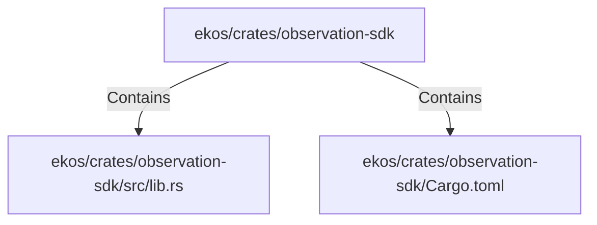

# ekos/crates/observation-sdk (Rollup)

## Properties

| Key | Value |
|---|---|
| `boundary_relationships` | {"Contains":19,"DependsOn":6} |
| `components` | {"File":2} |
| `group_key` | dir:ekos/crates/observation-sdk |
| `member_count` | 2 |

## Relationships

### Contains

- → ekos/crates/observation-sdk/src/lib.rs (`66ce958b-7250-5ec2-954e-eacf8f64aae0`) — evidence: ekos/crates/observation-sdk/src/lib.rs is a member of dir:ekos/crates/observation-sdk
- → ekos/crates/observation-sdk/Cargo.toml (`8bd33342-cac2-5f5e-b076-ee49a7b9dad0`) — evidence: ekos/crates/observation-sdk/Cargo.toml is a member of dir:ekos/crates/observation-sdk

## Diagram

## Evidence

- `571d5d91-f38f-4308-b82f-2ec9e07a41de` — ekos/crates/observation-sdk/src/lib.rs is a member of dir:ekos/crates/observation-sdk (confidence: 1.00)
- `66615d0e-d1f4-46b4-9d8f-e6eafe859bd1` — ekos/crates/observation-sdk/Cargo.toml is a member of dir:ekos/crates/observation-sdk (confidence: 1.00)
