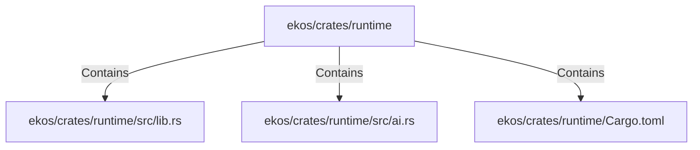

# ekos/crates/runtime (Rollup)

## Properties

| Key | Value |
|---|---|
| `boundary_relationships` | {"Contains":26,"CoupledWith":4,"DependsOn":31} |
| `components` | {"File":3} |
| `group_key` | dir:ekos/crates/runtime |
| `member_count` | 3 |

## Relationships

### Contains

- → ekos/crates/runtime/src/lib.rs (`7d8cf6bd-fac1-56d9-a742-4db7a455ab7c`) — evidence: ekos/crates/runtime/src/lib.rs is a member of dir:ekos/crates/runtime
- → ekos/crates/runtime/src/ai.rs (`e85e734d-ef58-5185-835a-34896d2da3f1`) — evidence: ekos/crates/runtime/src/ai.rs is a member of dir:ekos/crates/runtime
- → ekos/crates/runtime/Cargo.toml (`e7851889-11dd-5b29-83ec-ad9d03543067`) — evidence: ekos/crates/runtime/Cargo.toml is a member of dir:ekos/crates/runtime

## Diagram

## Evidence

- `aa5fc267-7332-40b3-8862-b8de46c1a6da` — ekos/crates/runtime/src/lib.rs is a member of dir:ekos/crates/runtime (confidence: 1.00)
- `4a0d98dd-7ce6-487d-8375-5ee3b1ee60bf` — ekos/crates/runtime/src/ai.rs is a member of dir:ekos/crates/runtime (confidence: 1.00)
- `ef798bd8-be93-4ddc-8660-51af084b8efe` — ekos/crates/runtime/Cargo.toml is a member of dir:ekos/crates/runtime (confidence: 1.00)
