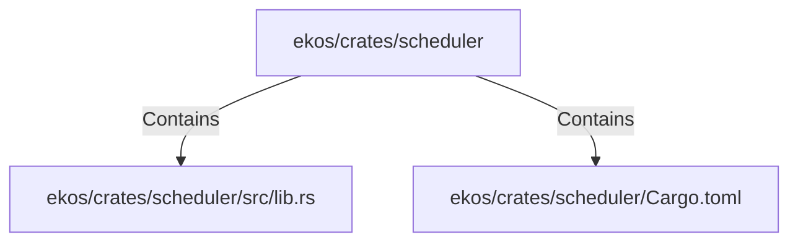

# ekos/crates/scheduler (Rollup)

## Properties

| Key | Value |
|---|---|
| `boundary_relationships` | {"DependsOn":4} |
| `components` | {"File":2} |
| `group_key` | dir:ekos/crates/scheduler |
| `member_count` | 2 |

## Relationships

### Contains

- → ekos/crates/scheduler/src/lib.rs (`d6e2aece-dda9-583d-90e2-a8fb96cb0edb`) — evidence: ekos/crates/scheduler/src/lib.rs is a member of dir:ekos/crates/scheduler
- → ekos/crates/scheduler/Cargo.toml (`36367efa-f47a-5128-bdc4-c6e5498e4b1f`) — evidence: ekos/crates/scheduler/Cargo.toml is a member of dir:ekos/crates/scheduler

## Diagram

## Evidence

- `7a31a2c1-5e06-46ec-a882-65a4777972e9` — ekos/crates/scheduler/src/lib.rs is a member of dir:ekos/crates/scheduler (confidence: 1.00)
- `ef364052-f50f-4b9d-a600-5475da74cf51` — ekos/crates/scheduler/Cargo.toml is a member of dir:ekos/crates/scheduler (confidence: 1.00)
