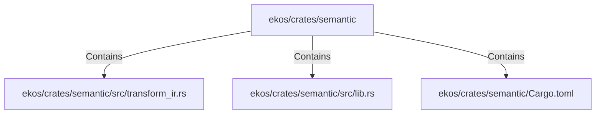

# ekos/crates/semantic (Rollup)

## Properties

| Key | Value |
|---|---|
| `boundary_relationships` | {"Contains":27,"CoupledWith":12,"DependsOn":32} |
| `components` | {"File":3} |
| `group_key` | dir:ekos/crates/semantic |
| `member_count` | 3 |

## Relationships

### Contains

- → ekos/crates/semantic/src/transform_ir.rs (`b4fdd24c-8184-5879-9136-f0a70208955e`) — evidence: ekos/crates/semantic/src/transform_ir.rs is a member of dir:ekos/crates/semantic
- → ekos/crates/semantic/src/lib.rs (`54021a72-4846-550c-960f-e63303e4d103`) — evidence: ekos/crates/semantic/src/lib.rs is a member of dir:ekos/crates/semantic
- → ekos/crates/semantic/Cargo.toml (`04adefce-9ec7-5a32-9677-5e96c3ec343c`) — evidence: ekos/crates/semantic/Cargo.toml is a member of dir:ekos/crates/semantic

## Diagram

## Evidence

- `78e7b5fe-f344-4603-b24d-d8a913846ced` — ekos/crates/semantic/src/transform_ir.rs is a member of dir:ekos/crates/semantic (confidence: 1.00)
- `202f61eb-d8a8-4a09-84ef-4f6fb236baa5` — ekos/crates/semantic/src/lib.rs is a member of dir:ekos/crates/semantic (confidence: 1.00)
- `32028c53-91f6-4c46-97ce-daf9a4d5ca5b` — ekos/crates/semantic/Cargo.toml is a member of dir:ekos/crates/semantic (confidence: 1.00)
