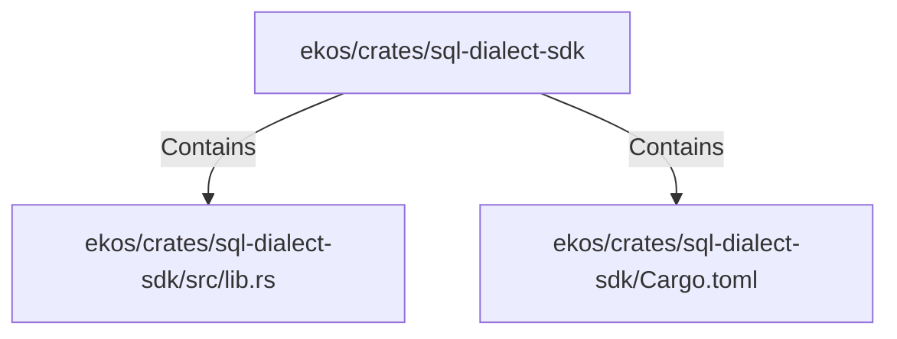

# ekos/crates/sql-dialect-sdk (Rollup)

## Properties

| Key | Value |
|---|---|
| `boundary_relationships` | {"Contains":1,"DependsOn":1} |
| `components` | {"File":2} |
| `group_key` | dir:ekos/crates/sql-dialect-sdk |
| `member_count` | 2 |

## Relationships

### Contains

- → ekos/crates/sql-dialect-sdk/src/lib.rs (`bace7c71-d661-554c-84b2-2fafb6b80602`) — evidence: ekos/crates/sql-dialect-sdk/src/lib.rs is a member of dir:ekos/crates/sql-dialect-sdk
- → ekos/crates/sql-dialect-sdk/Cargo.toml (`de77afa1-ce40-510c-8f37-2b67e06d4204`) — evidence: ekos/crates/sql-dialect-sdk/Cargo.toml is a member of dir:ekos/crates/sql-dialect-sdk

## Diagram

## Evidence

- `4f8c212a-51d3-4e1a-bc7e-55c8c7f1d896` — ekos/crates/sql-dialect-sdk/src/lib.rs is a member of dir:ekos/crates/sql-dialect-sdk (confidence: 1.00)
- `43cfc872-0bf5-4554-86d9-617ebe37a35d` — ekos/crates/sql-dialect-sdk/Cargo.toml is a member of dir:ekos/crates/sql-dialect-sdk (confidence: 1.00)
