# ekos/docs/rfcs (Rollup)

## Properties

| Key | Value |
|---|---|
| `boundary_relationships` | {"CoupledWith":2} |
| `components` | {"File":18} |
| `group_key` | dir:ekos/docs/rfcs |
| `member_count` | 18 |

## Relationships

### Contains

- → ekos/docs/rfcs/0041-rust-source-analyzer.md (`b05d1f14-c9aa-5061-96ca-2d9857544281`) — evidence: ekos/docs/rfcs/0041-rust-source-analyzer.md is a member of dir:ekos/docs/rfcs
- → ekos/docs/rfcs/0025-additional-document-formats.md (`03259ddb-0b8a-533d-9bd6-6bd4532735de`) — evidence: ekos/docs/rfcs/0025-additional-document-formats.md is a member of dir:ekos/docs/rfcs
- → ekos/docs/rfcs/0030-marketing-agent.md (`f0175be0-8733-559b-911d-3eab4e350f2c`) — evidence: ekos/docs/rfcs/0030-marketing-agent.md is a member of dir:ekos/docs/rfcs
- → ekos/docs/rfcs/0026-document-semantics-extraction.md (`61de4a94-7394-57be-9762-11d778c782f6`) — evidence: ekos/docs/rfcs/0026-document-semantics-extraction.md is a member of dir:ekos/docs/rfcs
- → ekos/docs/rfcs/0040-python-pyspark-analyzer.md (`455cf020-190d-53ec-9700-97a65a9a5656`) — evidence: ekos/docs/rfcs/0040-python-pyspark-analyzer.md is a member of dir:ekos/docs/rfcs
- → ekos/docs/rfcs/0037-curated-documentation-set.md (`10e30d1f-ad4b-5987-a6b0-49f3f362a2e5`) — evidence: ekos/docs/rfcs/0037-curated-documentation-set.md is a member of dir:ekos/docs/rfcs
- → ekos/docs/rfcs/0036-pentaho-to-dbt-export.md (`e01cbd1b-5a1e-5ec5-b96a-f3b114779bed`) — evidence: ekos/docs/rfcs/0036-pentaho-to-dbt-export.md is a member of dir:ekos/docs/rfcs
- → ekos/docs/rfcs/0029-cross-system-identity-resolution.md (`606988f9-d8e4-545d-a8f3-24fc9dc5d32c`) — evidence: ekos/docs/rfcs/0029-cross-system-identity-resolution.md is a member of dir:ekos/docs/rfcs
- → ekos/docs/rfcs/0027-unified-transformation-semantics.md (`5ae7452b-3e77-5b01-94b9-80a8b8243bba`) — evidence: ekos/docs/rfcs/0027-unified-transformation-semantics.md is a member of dir:ekos/docs/rfcs
- → ekos/docs/rfcs/0039-sql-pentaho-phase1-gaps.md (`32916eda-5fb1-5f39-a8be-2accaeba2475`) — evidence: ekos/docs/rfcs/0039-sql-pentaho-phase1-gaps.md is a member of dir:ekos/docs/rfcs
- → ekos/docs/rfcs/0035-generated-documentation.md (`598e2495-248f-5c08-8f78-a6afe205ac63`) — evidence: ekos/docs/rfcs/0035-generated-documentation.md is a member of dir:ekos/docs/rfcs
- → ekos/docs/rfcs/0034-partitioned-tiered-storage.md (`276841a4-ced3-57ea-99c4-768a58788bb5`) — evidence: ekos/docs/rfcs/0034-partitioned-tiered-storage.md is a member of dir:ekos/docs/rfcs
- → ekos/docs/rfcs/0042-production-grade-curated-docs.md (`0d6aaeb1-76cd-5449-9732-56c010bcec6c`) — evidence: ekos/docs/rfcs/0042-production-grade-curated-docs.md is a member of dir:ekos/docs/rfcs
- → ekos/docs/rfcs/0033-chat-connector.md (`8e0c787d-9cca-5ee0-a279-079d033b4b75`) — evidence: ekos/docs/rfcs/0033-chat-connector.md is a member of dir:ekos/docs/rfcs
- → ekos/docs/rfcs/0028-transformation-ir-mcp-tools.md (`649f6de4-d823-567c-9b23-bee300784f37`) — evidence: ekos/docs/rfcs/0028-transformation-ir-mcp-tools.md is a member of dir:ekos/docs/rfcs
- → ekos/docs/rfcs/0032-treasury-compliance.md (`08f64a8b-2d2b-5b09-a8c5-7091dd49ea67`) — evidence: ekos/docs/rfcs/0032-treasury-compliance.md is a member of dir:ekos/docs/rfcs
- → ekos/docs/rfcs/0038-code-knowledge-expansion-roadmap.md (`d9d358c1-08d5-552b-be18-98dcb19d09dd`) — evidence: ekos/docs/rfcs/0038-code-knowledge-expansion-roadmap.md is a member of dir:ekos/docs/rfcs
- → ekos/docs/rfcs/0031-pluggable-sql-dialects.md (`11ff3b01-0a03-521d-b294-b8fe9e1b8b87`) — evidence: ekos/docs/rfcs/0031-pluggable-sql-dialects.md is a member of dir:ekos/docs/rfcs

## Diagram

```mermaid
graph TD
    n082339ffadc3525493ce48dbff979db1["ekos/docs/rfcs"]
    nb05d1f14c9aa506196ca2d9857544281["ekos/docs/rfcs/0041-rust-source-analyzer.md"]
    n082339ffadc3525493ce48dbff979db1 -->|Contains| nb05d1f14c9aa506196ca2d9857544281
    n03259ddb0b8a533d9bd66bd4532735de["ekos/docs/rfcs/0025-additional-document-formats.md"]
    n082339ffadc3525493ce48dbff979db1 -->|Contains| n03259ddb0b8a533d9bd66bd4532735de
    nf0175be08733559b911d3eab4e350f2c["ekos/docs/rfcs/0030-marketing-agent.md"]
    n082339ffadc3525493ce48dbff979db1 -->|Contains| nf0175be08733559b911d3eab4e350f2c
    n61de4a94739457be976211d778c782f6["ekos/docs/rfcs/0026-document-semantics-extraction.md"]
    n082339ffadc3525493ce48dbff979db1 -->|Contains| n61de4a94739457be976211d778c782f6
    n455cf020190d53ec970097a65a9a5656["ekos/docs/rfcs/0040-python-pyspark-analyzer.md"]
    n082339ffadc3525493ce48dbff979db1 -->|Contains| n455cf020190d53ec970097a65a9a5656
    n10e30d1fad4b5987a6b049f3f362a2e5["ekos/docs/rfcs/0037-curated-documentation-set.md"]
    n082339ffadc3525493ce48dbff979db1 -->|Contains| n10e30d1fad4b5987a6b049f3f362a2e5
    ne01cbd1b5a1e5ec5b96af3b114779bed["ekos/docs/rfcs/0036-pentaho-to-dbt-export.md"]
    n082339ffadc3525493ce48dbff979db1 -->|Contains| ne01cbd1b5a1e5ec5b96af3b114779bed
    n606988f9d8e4545da8f324fc9dc5d32c["ekos/docs/rfcs/0029-cross-system-identity-resolution.md"]
    n082339ffadc3525493ce48dbff979db1 -->|Contains| n606988f9d8e4545da8f324fc9dc5d32c
    n5ae7452b3e775b0194b980a8b8243bba["ekos/docs/rfcs/0027-unified-transformation-semantics.md"]
    n082339ffadc3525493ce48dbff979db1 -->|Contains| n5ae7452b3e775b0194b980a8b8243bba
    n32916eda5fb15f39a8be2accaeba2475["ekos/docs/rfcs/0039-sql-pentaho-phase1-gaps.md"]
    n082339ffadc3525493ce48dbff979db1 -->|Contains| n32916eda5fb15f39a8be2accaeba2475
    n598e2495248f5c088f78a6afe205ac63["ekos/docs/rfcs/0035-generated-documentation.md"]
    n082339ffadc3525493ce48dbff979db1 -->|Contains| n598e2495248f5c088f78a6afe205ac63
    n276841a4ced357ea99c4768a58788bb5["ekos/docs/rfcs/0034-partitioned-tiered-storage.md"]
    n082339ffadc3525493ce48dbff979db1 -->|Contains| n276841a4ced357ea99c4768a58788bb5
    n0d6aaeb176cd5449973256c010bcec6c["ekos/docs/rfcs/0042-production-grade-curated-docs.md"]
    n082339ffadc3525493ce48dbff979db1 -->|Contains| n0d6aaeb176cd5449973256c010bcec6c
    n8e0c787d9cca5ee0a279079d033b4b75["ekos/docs/rfcs/0033-chat-connector.md"]
    n082339ffadc3525493ce48dbff979db1 -->|Contains| n8e0c787d9cca5ee0a279079d033b4b75
    n649f6de4d823567c9b23bee300784f37["ekos/docs/rfcs/0028-transformation-ir-mcp-tools.md"]
    n082339ffadc3525493ce48dbff979db1 -->|Contains| n649f6de4d823567c9b23bee300784f37
    n08f64a8b2d2b5b09a8c57091dd49ea67["ekos/docs/rfcs/0032-treasury-compliance.md"]
    n082339ffadc3525493ce48dbff979db1 -->|Contains| n08f64a8b2d2b5b09a8c57091dd49ea67
    nd9d358c108d5552bbe1898dcb19d09dd["ekos/docs/rfcs/0038-code-knowledge-expansion-roadmap.md"]
    n082339ffadc3525493ce48dbff979db1 -->|Contains| nd9d358c108d5552bbe1898dcb19d09dd
    n11ff3b010a03521db294b8fe9e1b8b87["ekos/docs/rfcs/0031-pluggable-sql-dialects.md"]
    n082339ffadc3525493ce48dbff979db1 -->|Contains| n11ff3b010a03521db294b8fe9e1b8b87
```

## Evidence

- `a8b592df-df33-44ad-b6a7-86f5488070df` — ekos/docs/rfcs/0041-rust-source-analyzer.md is a member of dir:ekos/docs/rfcs (confidence: 1.00)
- `d2279a12-2014-4077-99a4-02f846ae67a8` — ekos/docs/rfcs/0025-additional-document-formats.md is a member of dir:ekos/docs/rfcs (confidence: 1.00)
- `2883e53a-9fe7-4bfe-a051-12292db00d1c` — ekos/docs/rfcs/0030-marketing-agent.md is a member of dir:ekos/docs/rfcs (confidence: 1.00)
- `e29d4aa9-1a1a-41c6-af5e-e58756a0ce99` — ekos/docs/rfcs/0026-document-semantics-extraction.md is a member of dir:ekos/docs/rfcs (confidence: 1.00)
- `79a2b616-fb51-4dcc-b657-824a8a36f797` — ekos/docs/rfcs/0040-python-pyspark-analyzer.md is a member of dir:ekos/docs/rfcs (confidence: 1.00)
- `9a49199a-89c6-4ad7-95ec-8909c01fbc99` — ekos/docs/rfcs/0037-curated-documentation-set.md is a member of dir:ekos/docs/rfcs (confidence: 1.00)
- `ea609771-0543-42aa-be18-8d318668014b` — ekos/docs/rfcs/0036-pentaho-to-dbt-export.md is a member of dir:ekos/docs/rfcs (confidence: 1.00)
- `bda71d11-b250-480b-9dcb-3fce319f754c` — ekos/docs/rfcs/0029-cross-system-identity-resolution.md is a member of dir:ekos/docs/rfcs (confidence: 1.00)
- `12468564-e29a-4155-a7b6-d5d3f81e691f` — ekos/docs/rfcs/0027-unified-transformation-semantics.md is a member of dir:ekos/docs/rfcs (confidence: 1.00)
- `ac1c4ee1-4ebf-43a8-99b3-40d4411b2bf7` — ekos/docs/rfcs/0039-sql-pentaho-phase1-gaps.md is a member of dir:ekos/docs/rfcs (confidence: 1.00)
- `457fa10a-e622-43df-bae2-bcff3a0932b4` — ekos/docs/rfcs/0035-generated-documentation.md is a member of dir:ekos/docs/rfcs (confidence: 1.00)
- `044170a9-6f50-4436-9044-946a2f470b52` — ekos/docs/rfcs/0034-partitioned-tiered-storage.md is a member of dir:ekos/docs/rfcs (confidence: 1.00)
- `0b45f2a7-eb39-45cb-bc65-704bcdadda4a` — ekos/docs/rfcs/0042-production-grade-curated-docs.md is a member of dir:ekos/docs/rfcs (confidence: 1.00)
- `6598e04c-8f3d-4e33-b2a9-5423824f7a52` — ekos/docs/rfcs/0033-chat-connector.md is a member of dir:ekos/docs/rfcs (confidence: 1.00)
- `ee355d1b-4540-4d8f-b3dc-ee87bf3f680a` — ekos/docs/rfcs/0028-transformation-ir-mcp-tools.md is a member of dir:ekos/docs/rfcs (confidence: 1.00)
- `527a575c-8ac5-4f06-b7f5-51a35cc41fe6` — ekos/docs/rfcs/0032-treasury-compliance.md is a member of dir:ekos/docs/rfcs (confidence: 1.00)
- `793b559c-69f7-42b4-a5dd-a38c8fd1d6df` — ekos/docs/rfcs/0038-code-knowledge-expansion-roadmap.md is a member of dir:ekos/docs/rfcs (confidence: 1.00)
- `1fc5c68e-7284-4611-baad-898fb0576ae6` — ekos/docs/rfcs/0031-pluggable-sql-dialects.md is a member of dir:ekos/docs/rfcs (confidence: 1.00)
