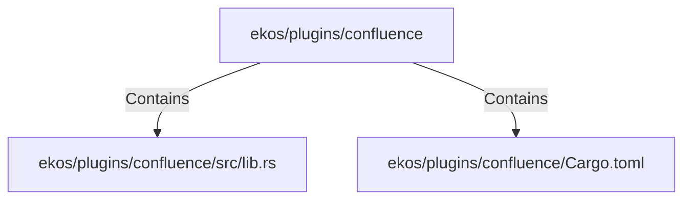

# ekos/plugins/confluence (Rollup)

## Properties

| Key | Value |
|---|---|
| `boundary_relationships` | {"Contains":14,"DependsOn":10} |
| `components` | {"File":2} |
| `group_key` | dir:ekos/plugins/confluence |
| `member_count` | 2 |

## Relationships

### Contains

- → ekos/plugins/confluence/src/lib.rs (`b78f02e6-8e4d-58de-abb4-ed29b9688c5f`) — evidence: ekos/plugins/confluence/src/lib.rs is a member of dir:ekos/plugins/confluence
- → ekos/plugins/confluence/Cargo.toml (`48fa6510-8e03-5dcb-a190-a3a9d1240892`) — evidence: ekos/plugins/confluence/Cargo.toml is a member of dir:ekos/plugins/confluence

## Diagram

## Evidence

- `669a75fb-575b-4625-98e5-09149f329823` — ekos/plugins/confluence/src/lib.rs is a member of dir:ekos/plugins/confluence (confidence: 1.00)
- `e9b36d0e-7460-4d8f-82a9-6a8bb5d43efe` — ekos/plugins/confluence/Cargo.toml is a member of dir:ekos/plugins/confluence (confidence: 1.00)
