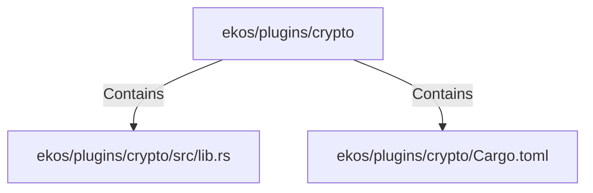

# ekos/plugins/crypto (Rollup)

## Properties

| Key | Value |
|---|---|
| `boundary_relationships` | {"Contains":22,"DependsOn":12} |
| `components` | {"File":2} |
| `group_key` | dir:ekos/plugins/crypto |
| `member_count` | 2 |

## Relationships

### Contains

- → ekos/plugins/crypto/src/lib.rs (`83728c61-df4d-5ad6-81c7-5bf50ff761fb`) — evidence: ekos/plugins/crypto/src/lib.rs is a member of dir:ekos/plugins/crypto
- → ekos/plugins/crypto/Cargo.toml (`b91b6309-f3db-56cd-80d1-d1d38239ed70`) — evidence: ekos/plugins/crypto/Cargo.toml is a member of dir:ekos/plugins/crypto

## Diagram

## Evidence

- `c829a0bb-d26e-4c99-96bc-9dc42524afe4` — ekos/plugins/crypto/src/lib.rs is a member of dir:ekos/plugins/crypto (confidence: 1.00)
- `a7a7e5b5-11ba-4244-b356-be2c223dda6d` — ekos/plugins/crypto/Cargo.toml is a member of dir:ekos/plugins/crypto (confidence: 1.00)
