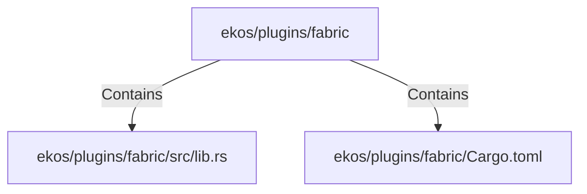

# ekos/plugins/fabric (Rollup)

## Properties

| Key | Value |
|---|---|
| `boundary_relationships` | {"Contains":14,"CoupledWith":4,"DependsOn":10} |
| `components` | {"File":2} |
| `group_key` | dir:ekos/plugins/fabric |
| `member_count` | 2 |

## Relationships

### Contains

- → ekos/plugins/fabric/src/lib.rs (`ea3988ed-2565-56db-b0cf-09b6d4594525`) — evidence: ekos/plugins/fabric/src/lib.rs is a member of dir:ekos/plugins/fabric
- → ekos/plugins/fabric/Cargo.toml (`8b9eb490-6a08-58e9-befd-b0e776eca5df`) — evidence: ekos/plugins/fabric/Cargo.toml is a member of dir:ekos/plugins/fabric

## Diagram

## Evidence

- `d70b8325-ef00-4933-a287-135e8422df9b` — ekos/plugins/fabric/src/lib.rs is a member of dir:ekos/plugins/fabric (confidence: 1.00)
- `3af5cfe3-0b5d-4c55-8d54-4167174cde02` — ekos/plugins/fabric/Cargo.toml is a member of dir:ekos/plugins/fabric (confidence: 1.00)
