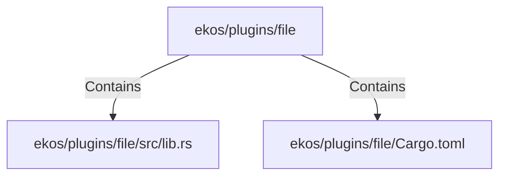

# ekos/plugins/file (Rollup)

## Properties

| Key | Value |
|---|---|
| `boundary_relationships` | {"Contains":7,"CoupledWith":2,"DependsOn":9} |
| `components` | {"File":2} |
| `group_key` | dir:ekos/plugins/file |
| `member_count` | 2 |

## Relationships

### Contains

- → ekos/plugins/file/src/lib.rs (`7cdc5253-6617-5e49-81c7-9e227a76c44b`) — evidence: ekos/plugins/file/src/lib.rs is a member of dir:ekos/plugins/file
- → ekos/plugins/file/Cargo.toml (`acae13df-dfe5-57f3-a785-0252f1a5ce77`) — evidence: ekos/plugins/file/Cargo.toml is a member of dir:ekos/plugins/file

## Diagram

## Evidence

- `2b36d729-79f3-4d47-a6cd-7250704506b3` — ekos/plugins/file/src/lib.rs is a member of dir:ekos/plugins/file (confidence: 1.00)
- `32c36d20-5386-4f3f-8f47-8c446295bc5f` — ekos/plugins/file/Cargo.toml is a member of dir:ekos/plugins/file (confidence: 1.00)
