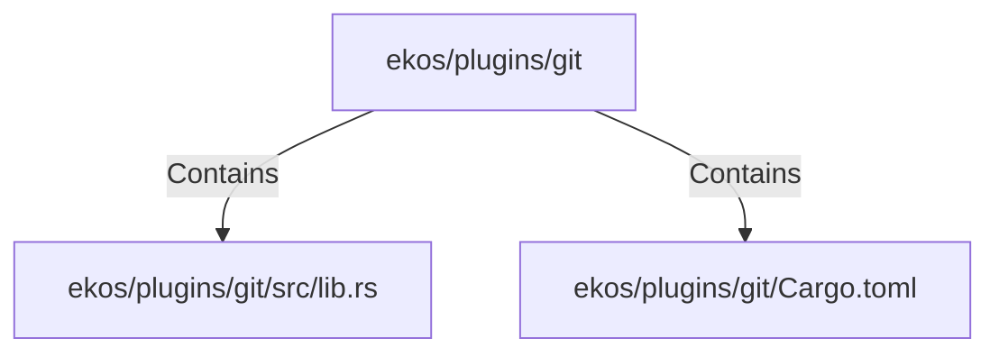

# ekos/plugins/git (Rollup)

## Properties

| Key | Value |
|---|---|
| `boundary_relationships` | {"Contains":9,"DependsOn":7} |
| `components` | {"File":2} |
| `group_key` | dir:ekos/plugins/git |
| `member_count` | 2 |

## Relationships

### Contains

- → ekos/plugins/git/src/lib.rs (`8941bcba-6474-5c7b-af9e-97dc4f4f7a13`) — evidence: ekos/plugins/git/src/lib.rs is a member of dir:ekos/plugins/git
- → ekos/plugins/git/Cargo.toml (`de0e9b2a-e46f-56b7-8adf-8bebadc42048`) — evidence: ekos/plugins/git/Cargo.toml is a member of dir:ekos/plugins/git

## Diagram

## Evidence

- `0cf0e1e9-54c0-4734-b82e-5f6a73599265` — ekos/plugins/git/src/lib.rs is a member of dir:ekos/plugins/git (confidence: 1.00)
- `2f3c389d-f868-41fa-97cf-ecc5bc0c9d72` — ekos/plugins/git/Cargo.toml is a member of dir:ekos/plugins/git (confidence: 1.00)
