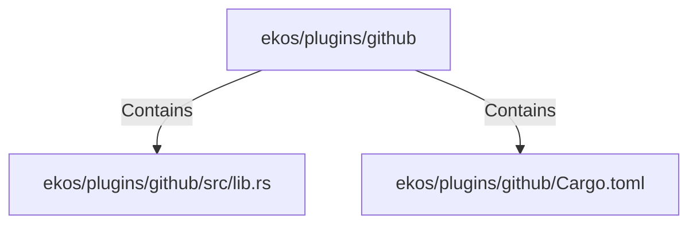

# ekos/plugins/github (Rollup)

## Properties

| Key | Value |
|---|---|
| `boundary_relationships` | {"Contains":15,"DependsOn":10} |
| `components` | {"File":2} |
| `group_key` | dir:ekos/plugins/github |
| `member_count` | 2 |

## Relationships

### Contains

- → ekos/plugins/github/src/lib.rs (`85954c06-2c57-57ee-8a60-8a92c239ab70`) — evidence: ekos/plugins/github/src/lib.rs is a member of dir:ekos/plugins/github
- → ekos/plugins/github/Cargo.toml (`2d28b82a-a6d7-5c8c-9ba6-21b96be7ba66`) — evidence: ekos/plugins/github/Cargo.toml is a member of dir:ekos/plugins/github

## Diagram

## Evidence

- `4d11834d-2878-4c31-b19f-d0dbe37ca21b` — ekos/plugins/github/src/lib.rs is a member of dir:ekos/plugins/github (confidence: 1.00)
- `44b2c38d-7fcf-46f5-836f-af9ef49b9a0f` — ekos/plugins/github/Cargo.toml is a member of dir:ekos/plugins/github (confidence: 1.00)
