# ekos/plugins/localdocs (Rollup)

## Properties

| Key | Value |
|---|---|
| `boundary_relationships` | {"Contains":54,"CoupledWith":19,"DependsOn":75} |
| `components` | {"File":9} |
| `group_key` | dir:ekos/plugins/localdocs |
| `member_count` | 9 |

## Relationships

### Contains

- → ekos/plugins/localdocs/src/html.rs (`612a67f9-5373-59bf-827a-16b82d635d53`) — evidence: ekos/plugins/localdocs/src/html.rs is a member of dir:ekos/plugins/localdocs
- → ekos/plugins/localdocs/src/docx.rs (`cb8db45b-ec2c-50f2-8053-0fd63dba3355`) — evidence: ekos/plugins/localdocs/src/docx.rs is a member of dir:ekos/plugins/localdocs
- → ekos/plugins/localdocs/src/email.rs (`fbdd8fb1-8ac2-5e5d-b95b-c1d0451eae6e`) — evidence: ekos/plugins/localdocs/src/email.rs is a member of dir:ekos/plugins/localdocs
- → ekos/plugins/localdocs/src/sanitize.rs (`553107f9-391e-5d35-83aa-e13b13604114`) — evidence: ekos/plugins/localdocs/src/sanitize.rs is a member of dir:ekos/plugins/localdocs
- → ekos/plugins/localdocs/src/ocr.rs (`815f45c0-f388-5213-9201-2c6958a02eba`) — evidence: ekos/plugins/localdocs/src/ocr.rs is a member of dir:ekos/plugins/localdocs
- → ekos/plugins/localdocs/src/lib.rs (`1ed81bd1-9be1-5cda-9158-9ad4f1980e3d`) — evidence: ekos/plugins/localdocs/src/lib.rs is a member of dir:ekos/plugins/localdocs
- → ekos/plugins/localdocs/src/text.rs (`fb7cfbed-8381-5078-b9d6-bc8b68af4e7d`) — evidence: ekos/plugins/localdocs/src/text.rs is a member of dir:ekos/plugins/localdocs
- → ekos/plugins/localdocs/src/pdf.rs (`c8cae073-dd9b-50d2-8942-335d3cdf47b3`) — evidence: ekos/plugins/localdocs/src/pdf.rs is a member of dir:ekos/plugins/localdocs
- → ekos/plugins/localdocs/Cargo.toml (`039ee6a5-dc52-5cf5-aaac-21bb61c008ee`) — evidence: ekos/plugins/localdocs/Cargo.toml is a member of dir:ekos/plugins/localdocs

## Diagram

```mermaid
graph TD
    n630b61e671d657b1b80482b41a9cb020["ekos/plugins/localdocs"]
    n612a67f9537359bf827a16b82d635d53["ekos/plugins/localdocs/src/html.rs"]
    n630b61e671d657b1b80482b41a9cb020 -->|Contains| n612a67f9537359bf827a16b82d635d53
    ncb8db45bec2c50f280530fd63dba3355["ekos/plugins/localdocs/src/docx.rs"]
    n630b61e671d657b1b80482b41a9cb020 -->|Contains| ncb8db45bec2c50f280530fd63dba3355
    nfbdd8fb18ac25e5db95bc1d0451eae6e["ekos/plugins/localdocs/src/email.rs"]
    n630b61e671d657b1b80482b41a9cb020 -->|Contains| nfbdd8fb18ac25e5db95bc1d0451eae6e
    n553107f9391e5d3583aae13b13604114["ekos/plugins/localdocs/src/sanitize.rs"]
    n630b61e671d657b1b80482b41a9cb020 -->|Contains| n553107f9391e5d3583aae13b13604114
    n815f45c0f388521392012c6958a02eba["ekos/plugins/localdocs/src/ocr.rs"]
    n630b61e671d657b1b80482b41a9cb020 -->|Contains| n815f45c0f388521392012c6958a02eba
    n1ed81bd19be15cda91589ad4f1980e3d["ekos/plugins/localdocs/src/lib.rs"]
    n630b61e671d657b1b80482b41a9cb020 -->|Contains| n1ed81bd19be15cda91589ad4f1980e3d
    nfb7cfbed83815078b9d6bc8b68af4e7d["ekos/plugins/localdocs/src/text.rs"]
    n630b61e671d657b1b80482b41a9cb020 -->|Contains| nfb7cfbed83815078b9d6bc8b68af4e7d
    nc8cae073dd9b50d28942335d3cdf47b3["ekos/plugins/localdocs/src/pdf.rs"]
    n630b61e671d657b1b80482b41a9cb020 -->|Contains| nc8cae073dd9b50d28942335d3cdf47b3
    n039ee6a5dc525cf5aaac21bb61c008ee["ekos/plugins/localdocs/Cargo.toml"]
    n630b61e671d657b1b80482b41a9cb020 -->|Contains| n039ee6a5dc525cf5aaac21bb61c008ee
```

## Evidence

- `298c3f59-039f-4124-a0f9-9d055223671d` — ekos/plugins/localdocs/src/html.rs is a member of dir:ekos/plugins/localdocs (confidence: 1.00)
- `18d9da54-8c95-4882-9372-ab45cd5f5425` — ekos/plugins/localdocs/src/docx.rs is a member of dir:ekos/plugins/localdocs (confidence: 1.00)
- `1c79fa19-48b7-4833-a7c0-41cfa2efc86f` — ekos/plugins/localdocs/src/email.rs is a member of dir:ekos/plugins/localdocs (confidence: 1.00)
- `3a41f097-539e-4dbc-98ee-c0e71c2f78cb` — ekos/plugins/localdocs/src/sanitize.rs is a member of dir:ekos/plugins/localdocs (confidence: 1.00)
- `78ae73df-4859-4204-b97c-82a59c6d5d08` — ekos/plugins/localdocs/src/ocr.rs is a member of dir:ekos/plugins/localdocs (confidence: 1.00)
- `8e312396-f837-4b58-b6fe-fafe164bce88` — ekos/plugins/localdocs/src/lib.rs is a member of dir:ekos/plugins/localdocs (confidence: 1.00)
- `1dc3388d-2da0-4c0e-adc7-66081ca5d60f` — ekos/plugins/localdocs/src/text.rs is a member of dir:ekos/plugins/localdocs (confidence: 1.00)
- `09278d18-8c4a-4114-9dc4-c6d7d741ab30` — ekos/plugins/localdocs/src/pdf.rs is a member of dir:ekos/plugins/localdocs (confidence: 1.00)
- `1edff7e2-618f-4905-8685-745df84e0619` — ekos/plugins/localdocs/Cargo.toml is a member of dir:ekos/plugins/localdocs (confidence: 1.00)
