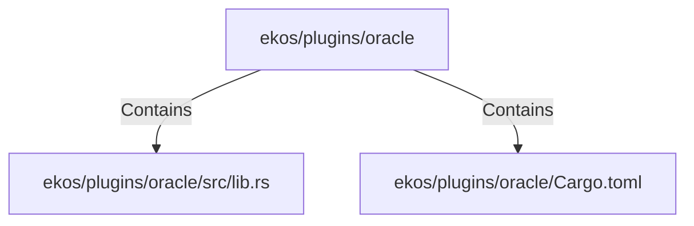

# ekos/plugins/oracle (Rollup)

## Properties

| Key | Value |
|---|---|
| `boundary_relationships` | {"Contains":20,"DependsOn":10} |
| `components` | {"File":2} |
| `group_key` | dir:ekos/plugins/oracle |
| `member_count` | 2 |

## Relationships

### Contains

- → ekos/plugins/oracle/src/lib.rs (`affbb6cf-64eb-5dd5-805d-01cf2bd08c7f`) — evidence: ekos/plugins/oracle/src/lib.rs is a member of dir:ekos/plugins/oracle
- → ekos/plugins/oracle/Cargo.toml (`2cbb745c-00cd-5424-b26c-699cc1cb0f3b`) — evidence: ekos/plugins/oracle/Cargo.toml is a member of dir:ekos/plugins/oracle

## Diagram

## Evidence

- `1b7b15ee-14c2-431d-9db9-5933035485b1` — ekos/plugins/oracle/src/lib.rs is a member of dir:ekos/plugins/oracle (confidence: 1.00)
- `7863cb3c-4057-4546-aed9-714614691c35` — ekos/plugins/oracle/Cargo.toml is a member of dir:ekos/plugins/oracle (confidence: 1.00)
