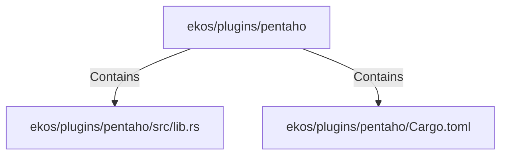

# ekos/plugins/pentaho (Rollup)

## Properties

| Key | Value |
|---|---|
| `boundary_relationships` | {"Contains":5,"DependsOn":9} |
| `components` | {"File":2} |
| `group_key` | dir:ekos/plugins/pentaho |
| `member_count` | 2 |

## Relationships

### Contains

- → ekos/plugins/pentaho/src/lib.rs (`cebff2b5-8142-5508-b8ad-01561647c1cc`) — evidence: ekos/plugins/pentaho/src/lib.rs is a member of dir:ekos/plugins/pentaho
- → ekos/plugins/pentaho/Cargo.toml (`4d7a948e-bacd-555b-a928-ab1257668aee`) — evidence: ekos/plugins/pentaho/Cargo.toml is a member of dir:ekos/plugins/pentaho

## Diagram

## Evidence

- `02209bda-cd0c-4795-9265-2279739489ed` — ekos/plugins/pentaho/src/lib.rs is a member of dir:ekos/plugins/pentaho (confidence: 1.00)
- `400bb3d7-1658-497c-9a56-c80b8466245e` — ekos/plugins/pentaho/Cargo.toml is a member of dir:ekos/plugins/pentaho (confidence: 1.00)
