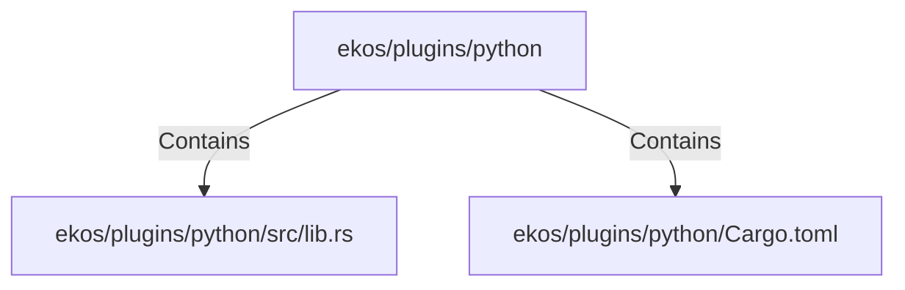

# ekos/plugins/python (Rollup)

## Properties

| Key | Value |
|---|---|
| `boundary_relationships` | {"Contains":4,"DependsOn":9} |
| `components` | {"File":2} |
| `group_key` | dir:ekos/plugins/python |
| `member_count` | 2 |

## Relationships

### Contains

- → ekos/plugins/python/src/lib.rs (`a3158b70-7e78-5501-8593-4a22c3e9c266`) — evidence: ekos/plugins/python/src/lib.rs is a member of dir:ekos/plugins/python
- → ekos/plugins/python/Cargo.toml (`07c3a002-f6ea-5e09-89b3-2983df83a973`) — evidence: ekos/plugins/python/Cargo.toml is a member of dir:ekos/plugins/python

## Diagram

## Evidence

- `88f4e5a5-75b9-4fcb-87ef-bb64e9c5564f` — ekos/plugins/python/src/lib.rs is a member of dir:ekos/plugins/python (confidence: 1.00)
- `1e76bef6-3df4-4bba-9529-7524b5641c23` — ekos/plugins/python/Cargo.toml is a member of dir:ekos/plugins/python (confidence: 1.00)
