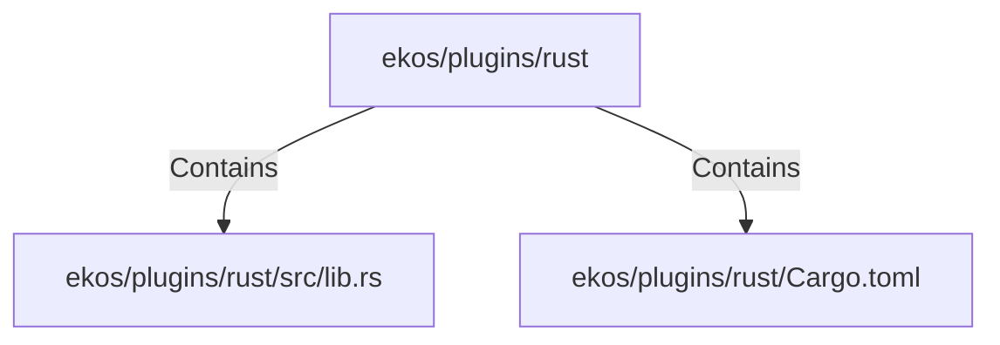

# ekos/plugins/rust (Rollup)

## Properties

| Key | Value |
|---|---|
| `boundary_relationships` | {"Contains":4,"DependsOn":9} |
| `components` | {"File":2} |
| `group_key` | dir:ekos/plugins/rust |
| `member_count` | 2 |

## Relationships

### Contains

- → ekos/plugins/rust/src/lib.rs (`1a06302f-f373-5d4e-9592-3d99844910e8`) — evidence: ekos/plugins/rust/src/lib.rs is a member of dir:ekos/plugins/rust
- → ekos/plugins/rust/Cargo.toml (`dfdd069f-fd17-5aeb-9596-b83fb0a2c788`) — evidence: ekos/plugins/rust/Cargo.toml is a member of dir:ekos/plugins/rust

## Diagram

## Evidence

- `572ea767-a18d-4df3-96e8-d6b2895ce573` — ekos/plugins/rust/src/lib.rs is a member of dir:ekos/plugins/rust (confidence: 1.00)
- `d2525224-bb3f-4187-bec5-e395b3001343` — ekos/plugins/rust/Cargo.toml is a member of dir:ekos/plugins/rust (confidence: 1.00)
