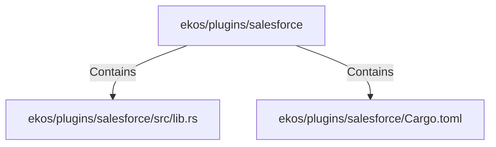

# ekos/plugins/salesforce (Rollup)

## Properties

| Key | Value |
|---|---|
| `boundary_relationships` | {"Contains":15,"CoupledWith":4,"DependsOn":10} |
| `components` | {"File":2} |
| `group_key` | dir:ekos/plugins/salesforce |
| `member_count` | 2 |

## Relationships

### Contains

- → ekos/plugins/salesforce/src/lib.rs (`62e147c2-5a91-534c-98ac-6557560db8f6`) — evidence: ekos/plugins/salesforce/src/lib.rs is a member of dir:ekos/plugins/salesforce
- → ekos/plugins/salesforce/Cargo.toml (`7264cb5e-c41d-5d24-96dd-0dc4626af651`) — evidence: ekos/plugins/salesforce/Cargo.toml is a member of dir:ekos/plugins/salesforce

## Diagram

## Evidence

- `73245633-2248-4aec-b993-1e1fe94774d2` — ekos/plugins/salesforce/src/lib.rs is a member of dir:ekos/plugins/salesforce (confidence: 1.00)
- `d61ff8a6-41e5-47d0-996f-d41424e3a650` — ekos/plugins/salesforce/Cargo.toml is a member of dir:ekos/plugins/salesforce (confidence: 1.00)
