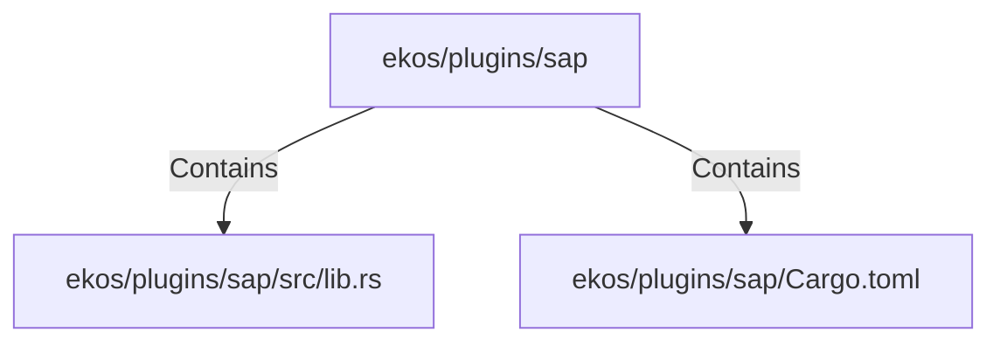

# ekos/plugins/sap (Rollup)

## Properties

| Key | Value |
|---|---|
| `boundary_relationships` | {"Contains":17,"CoupledWith":4,"DependsOn":10} |
| `components` | {"File":2} |
| `group_key` | dir:ekos/plugins/sap |
| `member_count` | 2 |

## Relationships

### Contains

- → ekos/plugins/sap/src/lib.rs (`8ce136d7-2eb9-53fd-90c2-7d0d00aeb27d`) — evidence: ekos/plugins/sap/src/lib.rs is a member of dir:ekos/plugins/sap
- → ekos/plugins/sap/Cargo.toml (`ab48cde6-37d7-5240-88f8-946454f0d137`) — evidence: ekos/plugins/sap/Cargo.toml is a member of dir:ekos/plugins/sap

## Diagram

## Evidence

- `d91c154f-c5df-4714-bfeb-cf48115eadde` — ekos/plugins/sap/src/lib.rs is a member of dir:ekos/plugins/sap (confidence: 1.00)
- `96503ffd-a60a-40bd-b581-fa938ab4a780` — ekos/plugins/sap/Cargo.toml is a member of dir:ekos/plugins/sap (confidence: 1.00)
