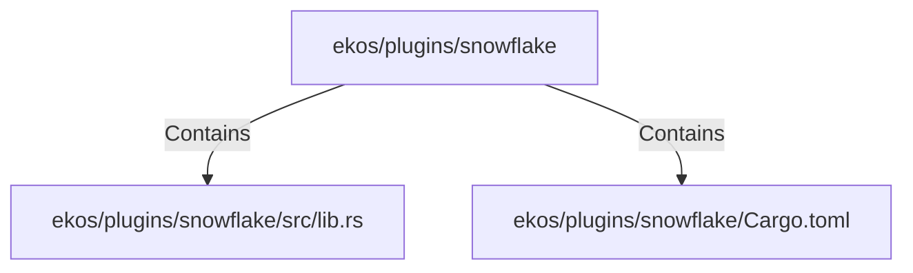

# ekos/plugins/snowflake (Rollup)

## Properties

| Key | Value |
|---|---|
| `boundary_relationships` | {"Contains":14,"CoupledWith":4,"DependsOn":10} |
| `components` | {"File":2} |
| `group_key` | dir:ekos/plugins/snowflake |
| `member_count` | 2 |

## Relationships

### Contains

- → ekos/plugins/snowflake/src/lib.rs (`1f09ad6b-972d-56d7-9597-8641b250abce`) — evidence: ekos/plugins/snowflake/src/lib.rs is a member of dir:ekos/plugins/snowflake
- → ekos/plugins/snowflake/Cargo.toml (`65819206-297a-5b7b-9b16-b97e3fd25e47`) — evidence: ekos/plugins/snowflake/Cargo.toml is a member of dir:ekos/plugins/snowflake

## Diagram

## Evidence

- `f99d3630-e4ac-4f3b-adc2-8b7bb51bb180` — ekos/plugins/snowflake/src/lib.rs is a member of dir:ekos/plugins/snowflake (confidence: 1.00)
- `b93552f2-7e03-4e67-9852-a6769775c9c4` — ekos/plugins/snowflake/Cargo.toml is a member of dir:ekos/plugins/snowflake (confidence: 1.00)
