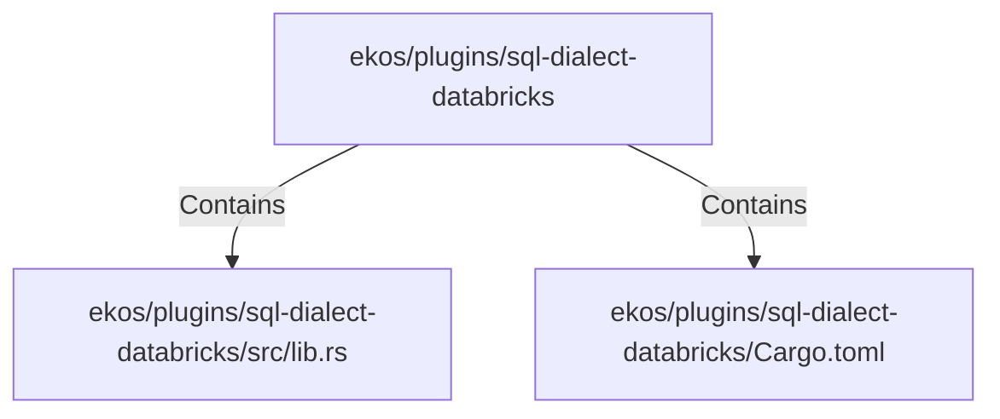

# ekos/plugins/sql-dialect-databricks (Rollup)

## Properties

| Key | Value |
|---|---|
| `boundary_relationships` | {"Contains":3,"DependsOn":3} |
| `components` | {"File":2} |
| `group_key` | dir:ekos/plugins/sql-dialect-databricks |
| `member_count` | 2 |

## Relationships

### Contains

- → ekos/plugins/sql-dialect-databricks/src/lib.rs (`e03746a2-2ca7-57cf-abcf-b40da11fd1d4`) — evidence: ekos/plugins/sql-dialect-databricks/src/lib.rs is a member of dir:ekos/plugins/sql-dialect-databricks
- → ekos/plugins/sql-dialect-databricks/Cargo.toml (`d58db168-d6e2-531a-9826-7c5217f0d76b`) — evidence: ekos/plugins/sql-dialect-databricks/Cargo.toml is a member of dir:ekos/plugins/sql-dialect-databricks

## Diagram

## Evidence

- `6791d46e-fc2b-4b25-b839-a2ac1a17ba0d` — ekos/plugins/sql-dialect-databricks/src/lib.rs is a member of dir:ekos/plugins/sql-dialect-databricks (confidence: 1.00)
- `52023317-29fd-454f-b09b-dbecd8978f87` — ekos/plugins/sql-dialect-databricks/Cargo.toml is a member of dir:ekos/plugins/sql-dialect-databricks (confidence: 1.00)
