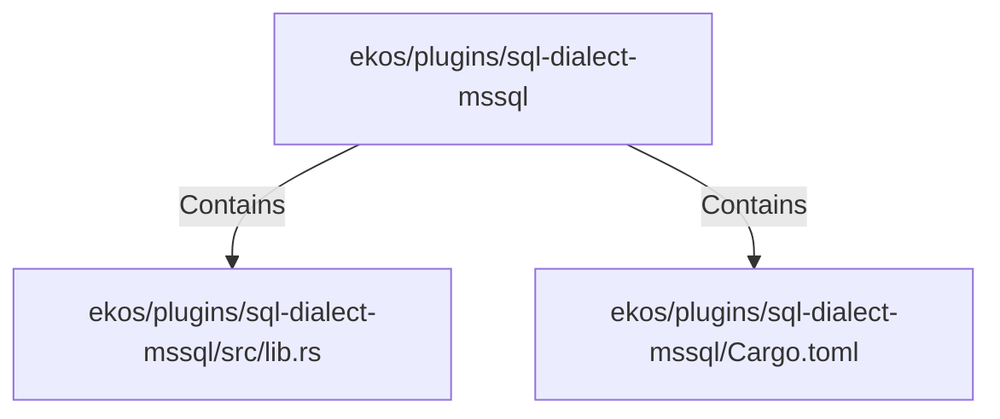

# ekos/plugins/sql-dialect-mssql (Rollup)

## Properties

| Key | Value |
|---|---|
| `boundary_relationships` | {"Contains":4,"DependsOn":3} |
| `components` | {"File":2} |
| `group_key` | dir:ekos/plugins/sql-dialect-mssql |
| `member_count` | 2 |

## Relationships

### Contains

- → ekos/plugins/sql-dialect-mssql/src/lib.rs (`c59f040e-79f2-52ac-86f5-a2484a89b01f`) — evidence: ekos/plugins/sql-dialect-mssql/src/lib.rs is a member of dir:ekos/plugins/sql-dialect-mssql
- → ekos/plugins/sql-dialect-mssql/Cargo.toml (`926c4fd1-572a-5617-a23b-a879c428be9b`) — evidence: ekos/plugins/sql-dialect-mssql/Cargo.toml is a member of dir:ekos/plugins/sql-dialect-mssql

## Diagram

## Evidence

- `326d7701-6d7d-47d1-b7ec-33f035a2b8b1` — ekos/plugins/sql-dialect-mssql/src/lib.rs is a member of dir:ekos/plugins/sql-dialect-mssql (confidence: 1.00)
- `5e2bb8e5-6d3d-410d-8035-bf7967973077` — ekos/plugins/sql-dialect-mssql/Cargo.toml is a member of dir:ekos/plugins/sql-dialect-mssql (confidence: 1.00)
