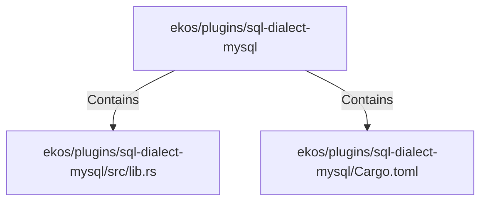

# ekos/plugins/sql-dialect-mysql (Rollup)

## Properties

| Key | Value |
|---|---|
| `boundary_relationships` | {"Contains":5,"DependsOn":3} |
| `components` | {"File":2} |
| `group_key` | dir:ekos/plugins/sql-dialect-mysql |
| `member_count` | 2 |

## Relationships

### Contains

- → ekos/plugins/sql-dialect-mysql/src/lib.rs (`5d3dc4f8-6d1a-5470-8a65-53b6c2be6d34`) — evidence: ekos/plugins/sql-dialect-mysql/src/lib.rs is a member of dir:ekos/plugins/sql-dialect-mysql
- → ekos/plugins/sql-dialect-mysql/Cargo.toml (`2b43a984-b4e6-5c31-b923-5b0c0f1683bf`) — evidence: ekos/plugins/sql-dialect-mysql/Cargo.toml is a member of dir:ekos/plugins/sql-dialect-mysql

## Diagram

## Evidence

- `1b1ba455-5493-40cc-9768-7c9bd4efcb7d` — ekos/plugins/sql-dialect-mysql/src/lib.rs is a member of dir:ekos/plugins/sql-dialect-mysql (confidence: 1.00)
- `ec1513e9-ad4b-4d95-bbb7-b22b9484d658` — ekos/plugins/sql-dialect-mysql/Cargo.toml is a member of dir:ekos/plugins/sql-dialect-mysql (confidence: 1.00)
