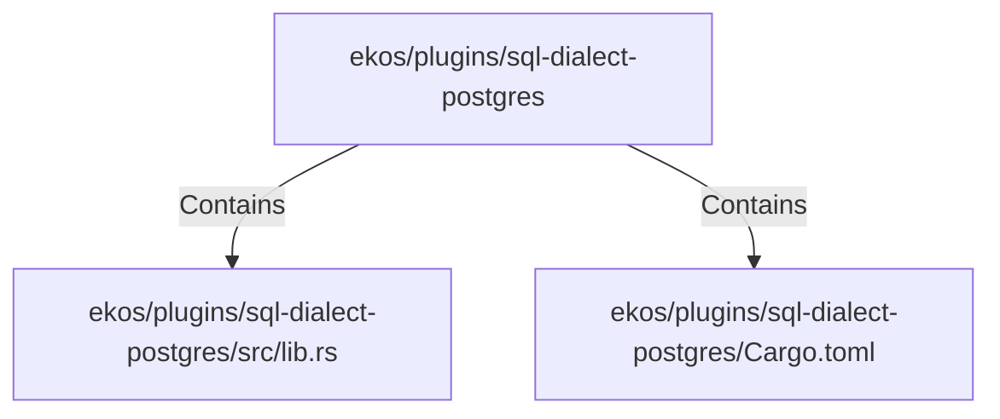

# ekos/plugins/sql-dialect-postgres (Rollup)

## Properties

| Key | Value |
|---|---|
| `boundary_relationships` | {"Contains":3,"DependsOn":3} |
| `components` | {"File":2} |
| `group_key` | dir:ekos/plugins/sql-dialect-postgres |
| `member_count` | 2 |

## Relationships

### Contains

- → ekos/plugins/sql-dialect-postgres/src/lib.rs (`4635063b-44e9-5cfb-97e8-4e39451ffe73`) — evidence: ekos/plugins/sql-dialect-postgres/src/lib.rs is a member of dir:ekos/plugins/sql-dialect-postgres
- → ekos/plugins/sql-dialect-postgres/Cargo.toml (`c82a5721-7995-59e8-a49b-21ed48421d71`) — evidence: ekos/plugins/sql-dialect-postgres/Cargo.toml is a member of dir:ekos/plugins/sql-dialect-postgres

## Diagram

## Evidence

- `3a0cdd1a-ad4a-485c-a611-863917afe177` — ekos/plugins/sql-dialect-postgres/src/lib.rs is a member of dir:ekos/plugins/sql-dialect-postgres (confidence: 1.00)
- `7d119fae-f48d-438c-a685-c6c5e38c2c64` — ekos/plugins/sql-dialect-postgres/Cargo.toml is a member of dir:ekos/plugins/sql-dialect-postgres (confidence: 1.00)
