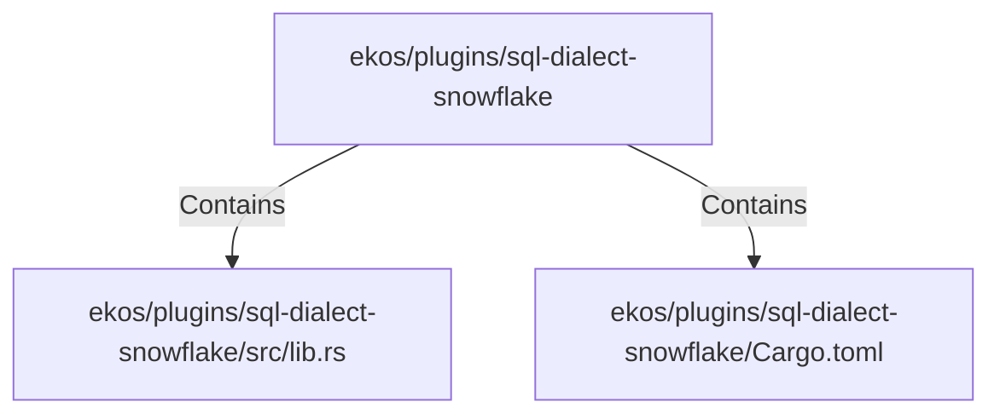

# ekos/plugins/sql-dialect-snowflake (Rollup)

## Properties

| Key | Value |
|---|---|
| `boundary_relationships` | {"Contains":3,"DependsOn":3} |
| `components` | {"File":2} |
| `group_key` | dir:ekos/plugins/sql-dialect-snowflake |
| `member_count` | 2 |

## Relationships

### Contains

- → ekos/plugins/sql-dialect-snowflake/src/lib.rs (`0417a4c7-1d0b-52f5-b2de-f52571e9dc2b`) — evidence: ekos/plugins/sql-dialect-snowflake/src/lib.rs is a member of dir:ekos/plugins/sql-dialect-snowflake
- → ekos/plugins/sql-dialect-snowflake/Cargo.toml (`0665c0a0-3179-5dac-89cc-e964bd7ae601`) — evidence: ekos/plugins/sql-dialect-snowflake/Cargo.toml is a member of dir:ekos/plugins/sql-dialect-snowflake

## Diagram

## Evidence

- `21e73c9e-1cf5-4227-a023-b460d9b3dbf3` — ekos/plugins/sql-dialect-snowflake/src/lib.rs is a member of dir:ekos/plugins/sql-dialect-snowflake (confidence: 1.00)
- `a414ea86-e61a-4ee4-a277-0b4b5f2638aa` — ekos/plugins/sql-dialect-snowflake/Cargo.toml is a member of dir:ekos/plugins/sql-dialect-snowflake (confidence: 1.00)
