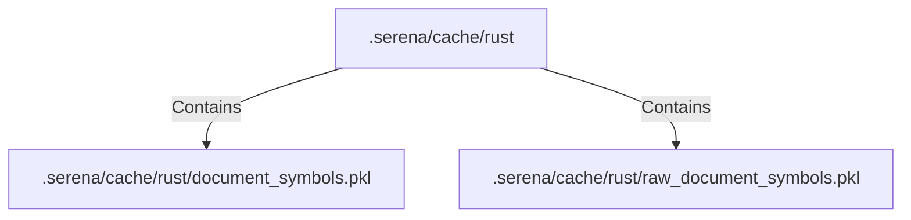

# .serena/cache/rust (Rollup)

## Properties

| Key | Value |
|---|---|
| `boundary_relationships` | {} |
| `components` | {"File":2} |
| `group_key` | dir:.serena/cache/rust |
| `member_count` | 2 |

## Relationships

### Contains

- → .serena/cache/rust/document_symbols.pkl (`0ee98461-735b-5407-b1bf-f320175ed867`) — evidence: .serena/cache/rust/document_symbols.pkl is a member of dir:.serena/cache/rust
- → .serena/cache/rust/raw_document_symbols.pkl (`3714a3d4-4b32-5d34-8e34-006f47657be2`) — evidence: .serena/cache/rust/raw_document_symbols.pkl is a member of dir:.serena/cache/rust

## Diagram

## Evidence

- `7d4136a9-8730-4016-a3f1-ee8f8c32ccd5` — .serena/cache/rust/document_symbols.pkl is a member of dir:.serena/cache/rust (confidence: 1.00)
- `3771654f-f076-4fd3-a511-7de9b7dd3f60` — .serena/cache/rust/raw_document_symbols.pkl is a member of dir:.serena/cache/rust (confidence: 1.00)
