# chrono::Utc (RustModule)

## Properties

_No compiled properties._

## Relationships

### DependsOn

- ← ekos/crates/kir/src/lib.rs (`078a10d5-8141-5e74-b89d-7120ec1be4f8`)
- ← ekos/crates/semantic/src/transform_ir.rs (`b4fdd24c-8184-5879-9136-f0a70208955e`)
- ← ekos/crates/ledger/src/lib.rs (`21938f45-b767-5933-9e71-12e15ff53eb1`)
- ← ekos/crates/ledger/src/fact_ledger.rs (`eadcb59e-818f-5d1e-af87-ff29aba11423`)
- ← ekos/crates/cli/src/commands/diff.rs (`162a5e91-5e60-5951-9a1c-14c60cd6109b`)
- ← ekos/crates/semantic/src/lib.rs (`54021a72-4846-550c-960f-e63303e4d103`)
- ← ekos/crates/cli/src/commands/mcp.rs (`ff76bb73-9285-5295-927c-5cb33a5bbc25`)
- ← ekos/crates/cli/src/commands/marketing.rs (`e4550c2d-5dcf-5779-b25d-ac86e4019342`)
- ← ekos/crates/cli/src/bin/ekos.rs (`67ea4c4e-5e03-5c3a-8066-adf7aaed8a3e`)
- ← ekos/crates/artifact/src/lib.rs (`918532b1-7390-5128-8de5-faf4f7a91daf`)
- ← ekos/crates/runtime/src/lib.rs (`7d8cf6bd-fac1-56d9-a742-4db7a455ab7c`)

## Diagram

```mermaid
graph TD
    nf459b4776d055ef886879411b793558e["chrono::Utc"]
    n078a10d581415e74b89d7120ec1be4f8["ekos/crates/kir/src/lib.rs"]
    n078a10d581415e74b89d7120ec1be4f8 -->|DependsOn| nf459b4776d055ef886879411b793558e
    nb4fdd24c818458799136f0a70208955e["ekos/crates/semantic/src/transform_ir.rs"]
    nb4fdd24c818458799136f0a70208955e -->|DependsOn| nf459b4776d055ef886879411b793558e
    n21938f45b76759339e7112e15ff53eb1["ekos/crates/ledger/src/lib.rs"]
    n21938f45b76759339e7112e15ff53eb1 -->|DependsOn| nf459b4776d055ef886879411b793558e
    neadcb59e818f5d1eaf87ff29aba11423["ekos/crates/ledger/src/fact_ledger.rs"]
    neadcb59e818f5d1eaf87ff29aba11423 -->|DependsOn| nf459b4776d055ef886879411b793558e
    n162a5e915e6059519a1c14c60cd6109b["ekos/crates/cli/src/commands/diff.rs"]
    n162a5e915e6059519a1c14c60cd6109b -->|DependsOn| nf459b4776d055ef886879411b793558e
    n54021a724846550c960fe63303e4d103["ekos/crates/semantic/src/lib.rs"]
    n54021a724846550c960fe63303e4d103 -->|DependsOn| nf459b4776d055ef886879411b793558e
    nff76bb7392855295927c5cb33a5bbc25["ekos/crates/cli/src/commands/mcp.rs"]
    nff76bb7392855295927c5cb33a5bbc25 -->|DependsOn| nf459b4776d055ef886879411b793558e
    ne4550c2d5dcf5779b25dac86e4019342["ekos/crates/cli/src/commands/marketing.rs"]
    ne4550c2d5dcf5779b25dac86e4019342 -->|DependsOn| nf459b4776d055ef886879411b793558e
    n67ea4c4e5e035c3a8066adf7aaed8a3e["ekos/crates/cli/src/bin/ekos.rs"]
    n67ea4c4e5e035c3a8066adf7aaed8a3e -->|DependsOn| nf459b4776d055ef886879411b793558e
    n918532b1739051288de5faf4f7a91daf["ekos/crates/artifact/src/lib.rs"]
    n918532b1739051288de5faf4f7a91daf -->|DependsOn| nf459b4776d055ef886879411b793558e
    n7d8cf6bdfac156d9a7424db7a455ab7c["ekos/crates/runtime/src/lib.rs"]
    n7d8cf6bdfac156d9a7424db7a455ab7c -->|DependsOn| nf459b4776d055ef886879411b793558e
```

## Evidence

_No evidence cited._
