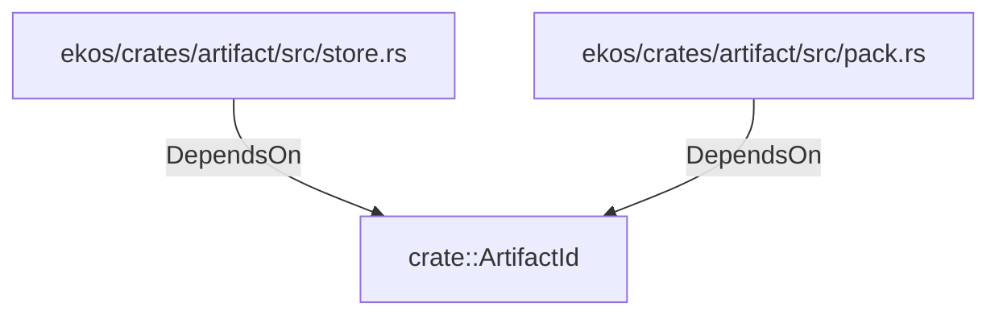

# crate::ArtifactId (RustModule)

## Properties

_No compiled properties._

## Relationships

### DependsOn

- ← ekos/crates/artifact/src/store.rs (`d997f78d-b111-570e-b530-510e98c14df8`)
- ← ekos/crates/artifact/src/pack.rs (`98cd7507-d9e7-59e3-acfb-c7ffb05d9f73`)

## Diagram

## Evidence

_No evidence cited._
