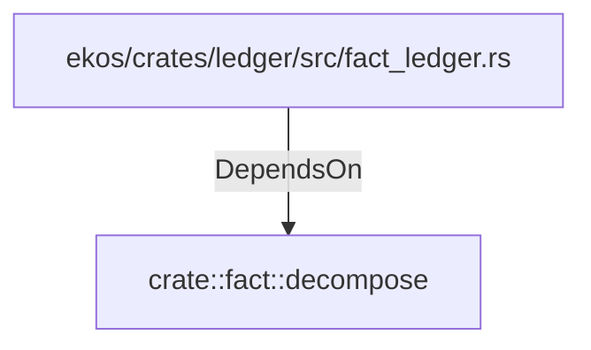

# crate::fact::decompose (RustModule)

## Properties

_No compiled properties._

## Relationships

### DependsOn

- ← ekos/crates/ledger/src/fact_ledger.rs (`eadcb59e-818f-5d1e-af87-ff29aba11423`)

## Diagram

## Evidence

_No evidence cited._
