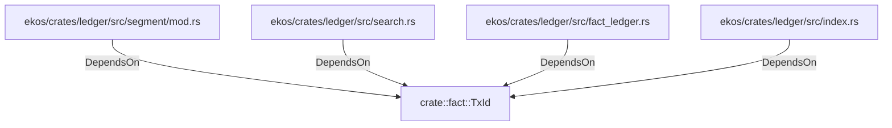

# crate::fact::TxId (RustModule)

## Properties

_No compiled properties._

## Relationships

### DependsOn

- ← ekos/crates/ledger/src/segment/mod.rs (`80a64e0a-b0ac-51df-b3be-128cddd1cc83`)
- ← ekos/crates/ledger/src/search.rs (`b419f7f5-ae3b-50d7-9192-7ef6954555ce`)
- ← ekos/crates/ledger/src/fact_ledger.rs (`eadcb59e-818f-5d1e-af87-ff29aba11423`)
- ← ekos/crates/ledger/src/index.rs (`a43fa387-2cac-5166-bfc2-ae4c965fc2ac`)

## Diagram

## Evidence

_No evidence cited._
